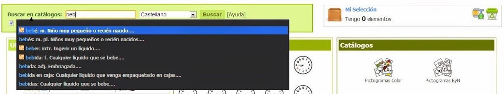
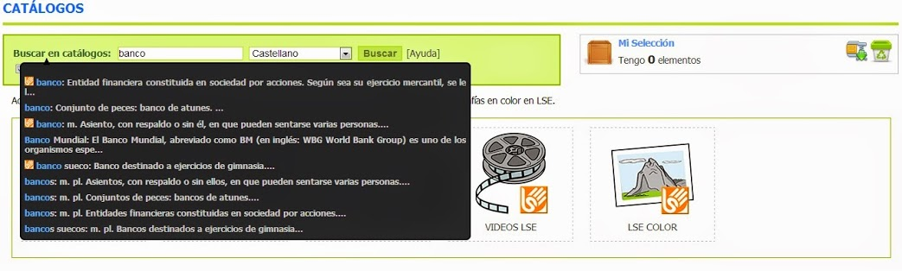
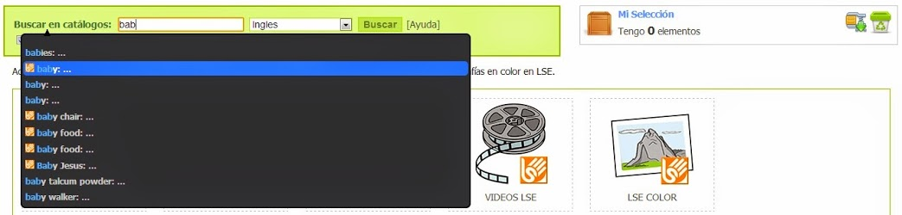
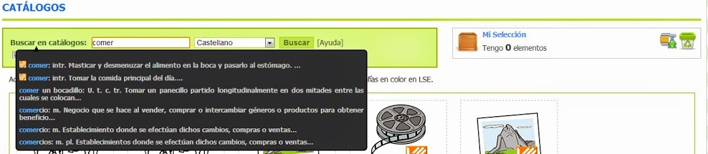
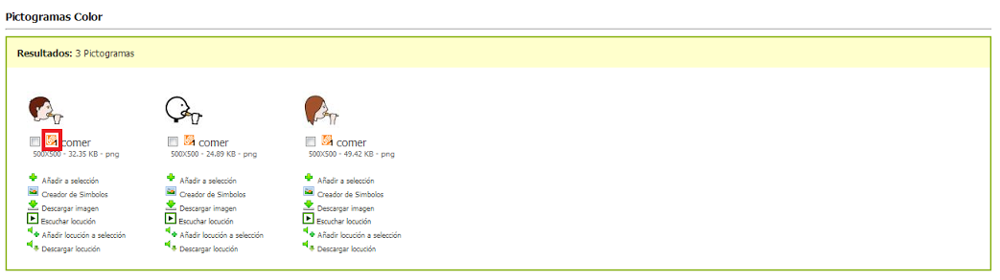
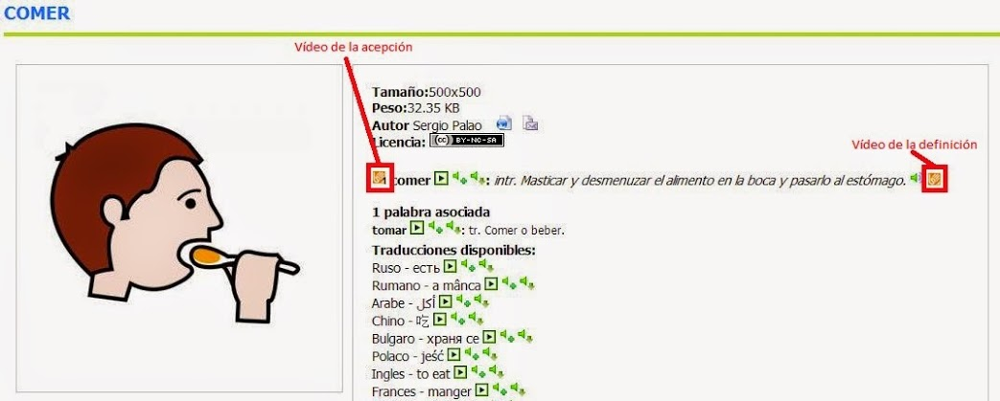

# 2.1 Palabras sugeridas - Inicio

En la página de [inicio](http://arasaac.org/index.php) y [catálogos](http://arasaac.org/catalogos.php) del portal ARASAAC disponemos de un buscador que nos permite realizar búsquedas en los diferentes catálogos de recursos gráficos.

La peculiaridad de este buscador es que, conforme se va escribiendo la palabra a buscar, el sistema va sugiriendo palabras que comiencen por la cadena de texto que vayamos escribiendo y que dispongan de recursos en algunos de los catálogos que tengamos marcados en los cuadros de selección debajo del cuadro de búsqueda.

De esta forma si vamos escribiendo: "**beb**" en el cuadro de búsqueda veremos como el sistema nos muestra **sugerencias** de palabras que comienzan por beb y que contienen recursos en los catálogos seleccionados.

De entre los resultados que se nos ofrecen haremos clic sobre aquel que nos interesa obtener recursos gráficos. En este caso se selecciona"bebé".

Este sistema de búsqueda es especialmente útil para obtener resultados únicamente de la acepción deseada. Un ejemplo claro sería en el caso de palabras homónimas en el que queramos obtener resultados de una única acepción.

La búsqueda se configura por defecto en el idioma con el que estemos navegando por el portal. Con todo, es posible buscar recursos gráficos en cada uno de los idiomas de los que se disponen traducciones. Para ello, basta con seleccionar el idioma deseado en el menú desplegable a la derecha del cuadro de búsqueda. Una vez seleccionado las sugerencias que haga el sistema será en el idioma seleccionado.

Finalmente, habría que destacar cómo ciertos resultados tienen delante de la palabra el logotipo de LSE (lengua de Signos Española). Eso significa que también se encuentra traducida a Lengua de Signos Española pudiéndose visionar el vídeo con el signado de la acepción y de la definición.  

De esta forma para la palabra comer en los resultados de la búsqueda podremos ver el logotipo de LSE. Si hacemos clic en él se abrirá una nueva ventana que nos permitirá visionar el signado de la acepción.

Si además de la acepción deseamos ver el signado de la definición deberemos acceder a la ficha del pictograma haciendo clic sobre la imagen o su nombre.

## Importante

Todos los buscadores por palabras de ARASAAC son sensibles a la ortografía. Eso implica que la búsqueda debe ser realizada utilizando acentos, diéresis, etc. En caso de no seguir esta recomendación podemos no obtener resultados de todos los términos deseados.

