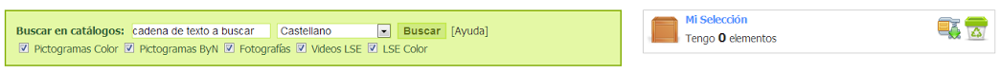
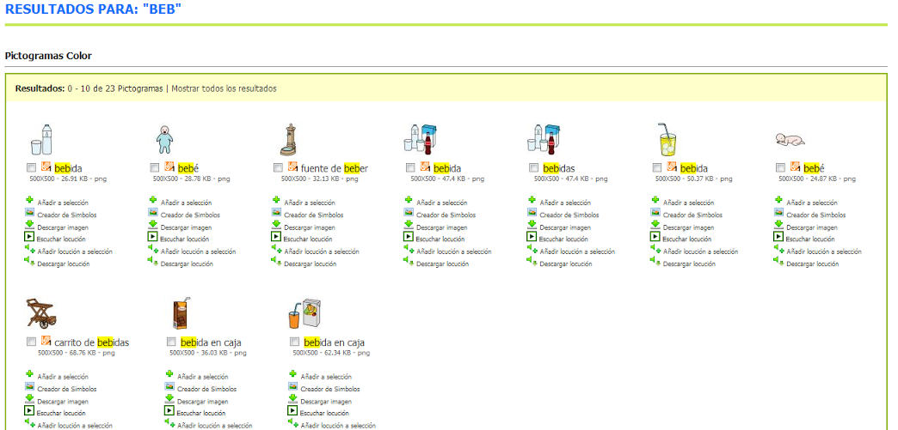
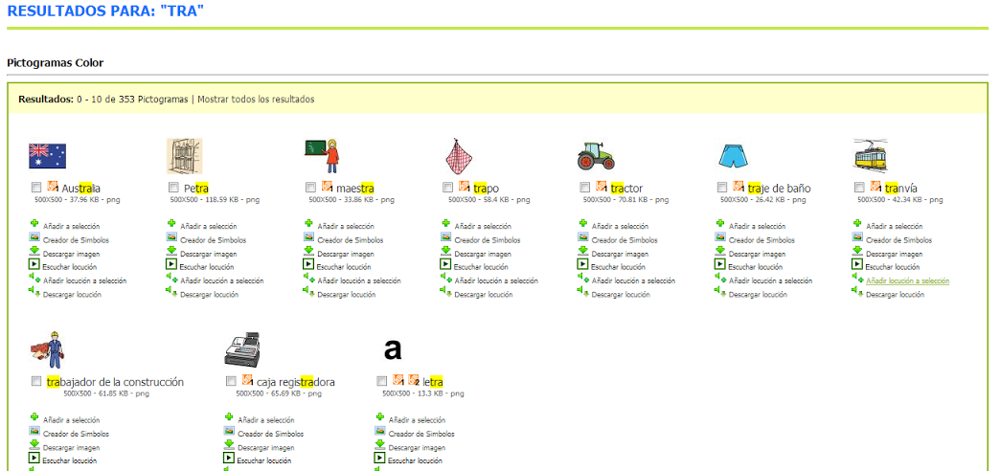

# 2.2. Cadena texto - Inicio

El buscador explicado anteriormente para la página de [inicio](http://arasaac.org/index.php) y[catálogos](http://arasaac.org/catalogos.php) del portal ARASAAC tiene una variante de uso que nos pueden resultar de interés en determinados casos.

La variante supone no hacer caso a la sugerencias que nos hace el sistema al comenzar a escribir una cadena de texto y pulsar el botón"Buscar" o pulsar la tecla"Enter" del teclado.

Como puede apreciarse en la captura de pantalla, el sistema busca la cadena de texto"beb" en cualquier parte de las palabras de las que se dispongan de recursos gráficos en los catálogos seleccionados.

Esta posibilidad de búsqueda tiene gran potencialidad para la obtención de determinados recursos para trabajar el lenguaje o para la rehabilutación logopédica. Así, por ejemplo, se pueden buscar recursos que contengan un determinado sinfón, como"tra" (como puede verse en la captura de pantalla a continuación).

Al igual que se comentaba en el anterior sistema de búsqueda se puede filtrar la búsqueda por un determinado idioma o limitarla a unos determinados catálogos marcando o desmarcando éstos.

## Importante

Todos los buscadores por palabras de ARASAAC son sensibles a la ortografía. Eso implica que la búsqueda debe ser realizada utilizando acentos, diéresis, etc. En caso de no seguir esta recomendación podemos no obtener resultados de todos los términos deseados.

