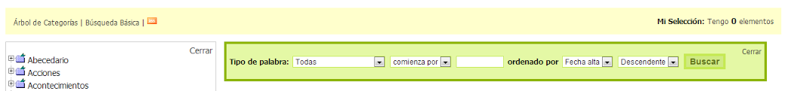
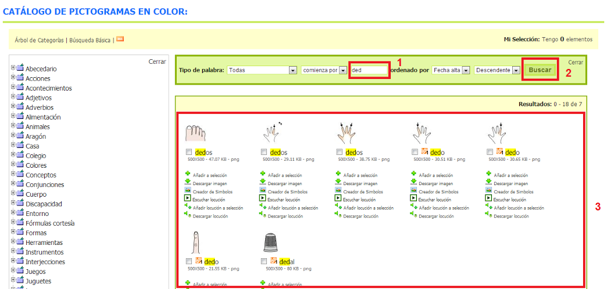
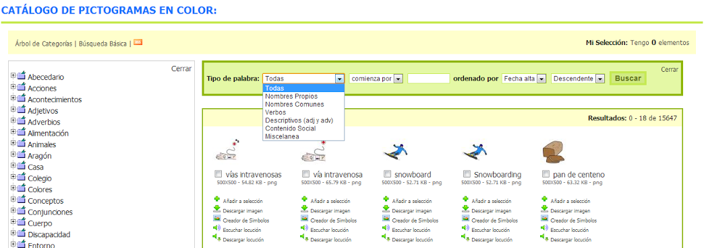
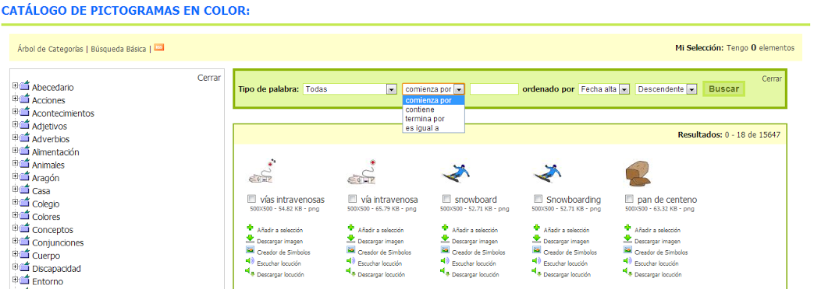

# 2.3. Cadena texto - Catálogos

Dentro de cada uno de los [catálogos](http://arasaac.org/catalogos.php)de recursos ([pictogramas color](http://arasaac.org/pictogramas_color.php), [blanco y negro](http://arasaac.org/pictogramas_byn.php), [fotografías](http://arasaac.org/imagenes.php), [vídeos en LSE](http://arasaac.org/videos_lse.php),...) hay disponible un buscador que permite realizar búsquedas por **cadena de texto** dentro del catálogo que estemos consultando.

Para obtener resultados tan solo deberemos escribir la cadena de texto (1) y pulsar el botón "Buscar" (2).

Este buscador tiene dos variables importantes que permiten filtrar las búsquedas:

### Tipo de palabra

Esta variable nos permite filtrar los resultados por los seis tipos de palabra que son un standard internacional en el mundo de la comunicación aumentativa. Éstos vienen definidos, cada uno de ellos, por un código de color (estos códigos de color serán explicados en la herramienta creador de símbolos en el siguiente módulo).

### Posición de la cadena de texto dentro de la palabra

Otra de las variables que admite el buscador es la búsqueda de la cadena de texto en una determinada posición dentro de la palabra o la búsqueda de la cadena de modo exacto (palabra completa). Esta variable resulta de gran utilidad para la elaboración de determinados materiales ling&uuml;ísticos.

Combinando la cadena de texto a buscar con las dos variables explicadas podemos realizar búsquedas potentes dentro de cada uno de los catálogos.

## Importante

Todos los buscadores por palabras de ARASAAC son sensibles a la ortografía. Eso implica que la búsqueda debe ser realizada utilizando acentos, diéresis, etc. En caso de no seguir esta recomendación podemos no obtener resultados de todos los términos deseados.

