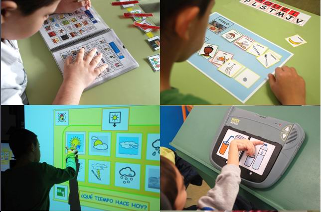

# 4.1 Usuarios

Si tomamos como referente lo explicado anteriormente en la Unidad 3 (Conocimiento de diferentes SAAC) podemos afirmar que aquellos usuarios que se pueden beneficiar de los sistemas pictográficos de comunicación son:

- **Personas con movilidad reducida**, incluso casos de extrema gravedad, junto con productos de apoyo específicos de baja o alta tecnología. En este grupo incluimos personas conparálisis cerebral (PC), personas que sufrenenfermedades neurológicas tales como la [esclerosis lateral amiotrófica](http://es.wikipedia.org/wiki/Esclerosis_lateral_amiotr%C3%B3fica) (ELA), la [esclerosis múltiple](http://es.wikipedia.org/wiki/Esclerosis_m%C3%BAltiple) (EM) o el [párkinson](http://es.wikipedia.org/wiki/P%C3%A1rkinson), las [distrofias musculares](http://es.wikipedia.org/wiki/Distrofia_muscular) o los [traumatismos cráneo-encefálicos](http://es.wikipedia.org/wiki/Traumatismo_craneoencef%C3%A1lico). En todos los casos, el común denominador es la ausencia de lenguaje oral o la presencia de restos no funcionales, junto con una imposibilidad motriz para el acceso a otros SAAC como la escritura. Dentro de este grupo podemos encontrar, adicionalmente, diferentes grados de afectación cognitiva y del lenguaje.

- **Personas con discapacidad intelectual**. Dentro de este grupo encontramos también diversidad en cuanto a la afectación del lenguaje sobrevenida por la discapacidad intelectual. Los sistemas de comunicación mediante pictogramas tienen la ventaja de permitir desde un nivel de comunicación muy básico, que se adapta a personas con niveles cognitivos bajos o en etapas muy iniciales, hasta un nivel de comunicación muy rico y avanzado.

- En el caso de **Personas con TEA** (Trastornos del Espectro Autista) los pictogramas pueden servirles no sólo como sistema de comunicación aumentativa, sino también para trabajar las rutinas, la anticipación, la orientación temporal y la orientación espacial.

- Personas que han sufrido **accidentes cerebrovasculares**. A consecuencia de estos accidentes se producen, en algunos casos, [afasias](http://es.wikipedia.org/wiki/Afasia) más o menos severas entre cuyas consecuencias puede estar la pérdida del lenguaje oral.

- Personas de **origen extranjero** que **desconocen el idioma**.

- **Personas con enfermedades neurológicas degenerativas**. En este grupo encontramos a un cada mayor número de personas, en su mayor parte mayores, que sufren de algún tipo de [demencia](http://es.wikipedia.org/wiki/Demencia) o enfermedad degenerativa como el [Alzheimer](http://es.wikipedia.org/wiki/Alzheimer). A consecuencia de ésta, pierden el lenguaje oral y requieren un sistema alternativo de comunicación.

