# 6.3 Ideosincrasia

Partiendo de que los sistemas pictográficos deben tener coherencia, podemos afirmar que ARASAAC tiene su propia idiosincrasia, en tanto que presenta sus propias reglas que para las personas que lo utilizan son imprescindibles.

ARASAAC ofrece dos sistemas pictográficos: **descriptivo** y **esquemático**. El sistema descriptivo es utilizado por usuarios con un menor nivel de comunicación y que necesitan referentes más similares a la realidad para interpretar su significado. El sistema esquemático, en cambio,&nbsp; está dise&ntilde;ado para usuarios con una mayor nivel comunicativo y mayor capacidad cognitiva y comprensiva.&nbsp;
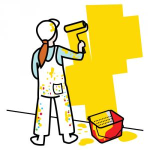
<td style="text-align: center;"><pre>Fig. 1.22 Pintar descriptivo mujer</pre></td><td style="text-align: center;"><pre>Fig. 1.23 Pintar descriptivo hombre</pre></td><td style="text-align: center;"><pre>Fig. 1.24 Pintar Esquemático</pre></td>

Otra de las características propias de ARASAAC es la forma de construcción de los** plurales**, utilizando el signo&nbsp;**&ldquo;+&rdquo; **y la grafía&nbsp;**&rdquo;s&rdquo;**. El signo &ldquo;+&rdquo; es reconocido como símbolo de pluralidad en cualquier lugar del mundo y la grafía &ldquo;s&rdquo; se utiliza para la construcción del plural en muchos de los idiomas que utilizan ARASAAC.&nbsp;
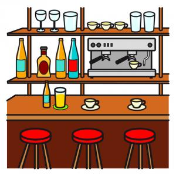
<td style="text-align: center;">Fig. 1.25 Cafetería en singular</td><td style="text-align: center;">Fig. 1.26 Cafetería en Plural</td>

En algunos casos, el uso de** elementos identificativos**&nbsp;(en la esquina superior derecha de los pictogramas) nos permite mejorar la comprensión del pictograma, asociando el elemento representado en la zona central a un determinado contexto: hospital-cruz roja, biblioteca-libro, dolor corporal-rayo), &hellip;

<td style="text-align: center;">Fig. 1.27 Alcohol</td><td style="text-align: center;">Fig. 1.28&nbsp;Dolor de cabeza</td><td style="text-align: center;">Fig. 1.29&nbsp;Fondo Aragonés</td>

La representación de **conceptos abstractos**&nbsp;mediante pictogramas es un aspecto complejo y, en muchos casos, difícil de comprender para los usuarios por su carácter no tangible. Para representar estos conceptos utilizamos el sustantivo y le colocamos una** nube **a su alrededor, que representa su carácter abstracto o etéreo. A continuación tenéis el ejemplo de amigos y amistad.
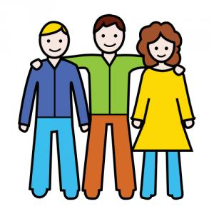
<td style="text-align: center;">Fig. 1.30&nbsp;Amigos</td><td style="text-align: center;">Fig. 1.31&nbsp;Amistad</td>

Los pictogramas relacionados con** lugares**, **talleres** o **edificios** se caracterizan por tener el elemento representativo correspondiente dentro de un **contenedor** que diferencia si se trata de un edificio (contorno casa), una habitación (cuadrado), un taller (contorno fábrica).
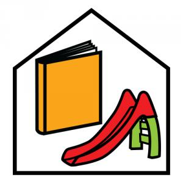
<td style="text-align: center;">Fig. 1.32&nbsp;Colegio Esquemático</td><td style="text-align: center;">Fig. 1.33&nbsp;Hospital Esquemático</td>
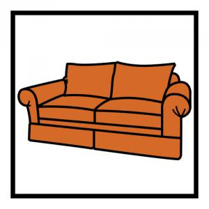
<td style="text-align: center;">Fig. 1.34&nbsp;Salón</td><td style="text-align: center;">Fig. 1.35&nbsp;Carpintería</td>

ARASAAC se caracteriza también por disponer de un amplio vocabulario adaptado a todos los ámbitos de social actual: familiar, religioso, diversidad, etc.

En el ámbito de la religión podemos ver una muestra de la variedad de los pictogramas existentes en la galería inferior&nbsp;y como éstos contemplan las religiones mayoritarias con elementos representativos de cada una de ellas.

## Religión

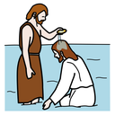

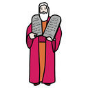
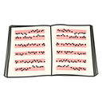
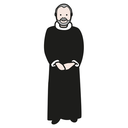
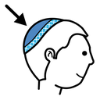
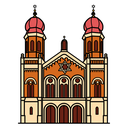
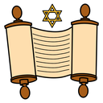
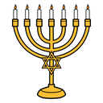
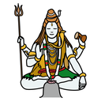

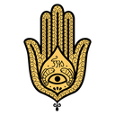
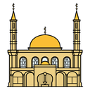
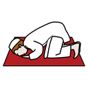

