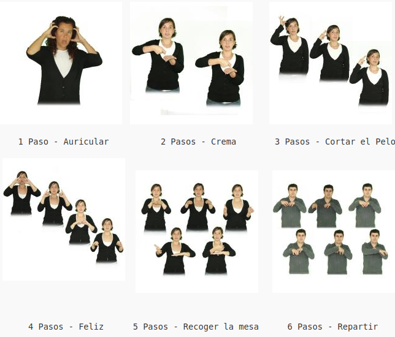

# 7.1 Catálogos

Además del catálogo de pictogramas, ARASAAC ofrece otros tres catálogos que nos pueden resultar de utilidad en determinados casos. Vamos a detallar cada uno de los cinco catálogos existentes:

## [PICTOGRAMAS EN COLOR](http://arasaac.org/pictogramas_color.php)

El número actual de pictogramas únicos en color ronda los 9500 pictogramas, cantidad que va aumentando progresivamente. Cuando los pictogramas se catalogan en ARASAAC, cada uno de ellos puede asociarse a una o más acepciones del diccionario de castellano, lo que hace que, actualmente, se disponga de más de 15600 pictogramas en color.

## [PICTOGRAMAS EN BLANCO Y NEGRO](http://arasaac.org/pictogramas_byn.php)

Además del catálogo de pictogramas en color, se ofrece otro catálogo con los pictogramas en blanco y negro para su utilización en aquellos casos en los que no se requiere o no se desea utilizar el color.

El catálogo de pictogramas en blanco y negro dispone de menor número de pictogramas con respecto al de color, porque muchos de ellos, sin la presencia del color, no tendrían sentido. Un ejemplo claro es el de las banderas o el de las señales de tráfico. Actualmente son más de13500 los pictogramas en blanco y negro disponibles.

## [FOTOGRAFÍAS](http://arasaac.org/imagenes.php)

El catálogo de fotografías nos permite acceder a imágenes reales de objetos preparados en formato cuadrado y con el objeto isolado en fondo, preferentemente, blanco. Son imágenes preparadas para ser utilizadas como pictogramas y tienen una gran utilidad en estadios iniciales de introducción de los sistemas aumentativos o alternativos de comunicación, al ser el nexo de unión entre el objeto real y los pictogramas que se introducen con posterioridad.

El catálogo cuenta actualmente con unas 1400 fotografías.

Fig. 1.38 Captura de pantalla del catálogo de Fotografías

[VÍDEOS EN Lengua de Signos Española (LSE)](http://arasaac.org/videos_lse.php)

Este catálogo ofrece vídeos con el signado de 4100 términos y de sus definiciones de la RAE.

En muchos centros la comunicación aumentativa a través de pictogramas se complementa con el uso de signos de bimodal que, en la mayor parte de los casos, coincide con la LSE. De ahí la utilidad de este catálogo para todos aquellos profesores que utilicen signos de modo complementario o, para aquellos, que están aprendiendo la Lengua de Signos.

[FOTOGRAFÍAS EN LSE](http://arasaac.org/signos_lse_color.php)

El catálogo de Fotografías en Lengua de Signos Española supone una novedad en relación al uso de la misma, ya que ofrece imágenes fijas que, posteriormente, pueden ser insertadas en documentos impresos, tarea totalmente imposible con el uso de los vídeos.

Para poder crear la imagen fija del signado de una palabra lo que se hizo fue descomponer el signado en los pasos clave que lo definen en fotogramas que, posteriormente, se compusieron en una única imagen. De este modo, podemos encontrar fotografías con hasta 6 pasos agrupados en una única imagen.

