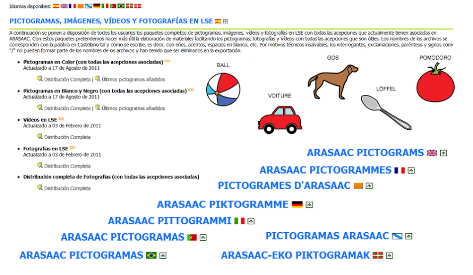
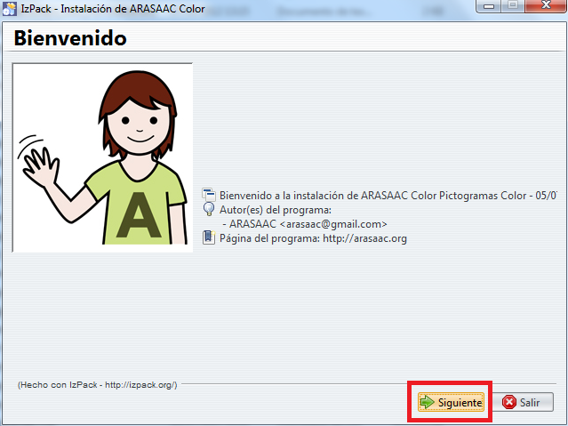
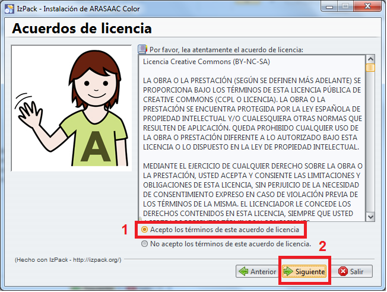
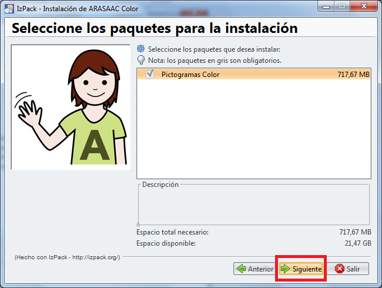
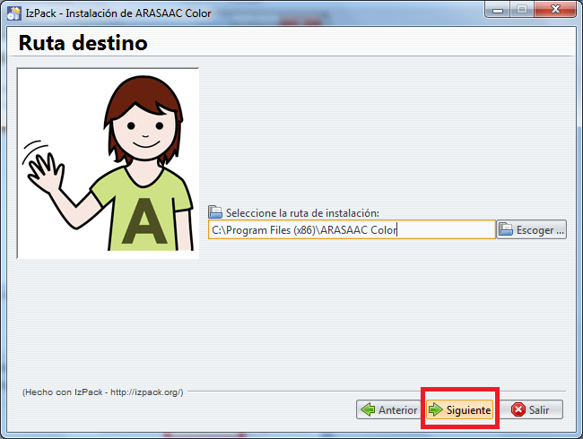
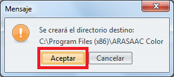
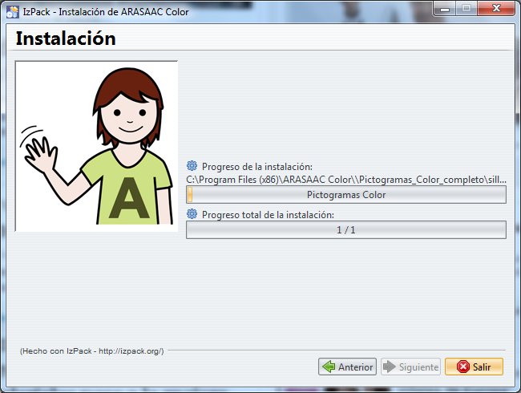
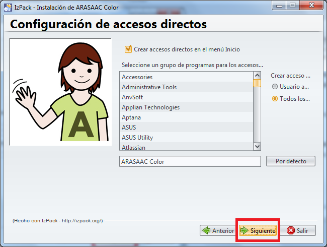
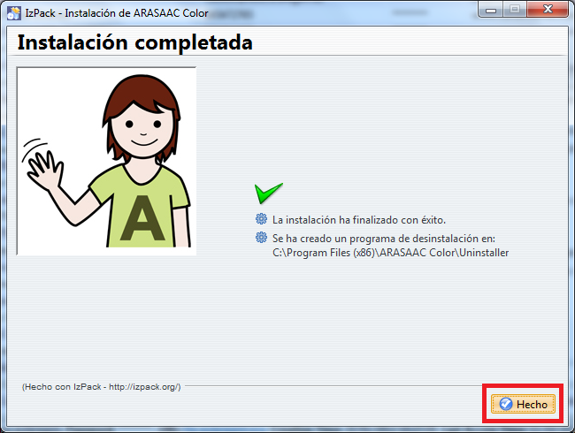

# 7.2 Descargas

Con el fin de facilitar la elaboración de materiales y disponer en local de los recursos que ofrece el portal, sin tener que estar conectado a Internet, ARASAAC ofrece una serie de paquetes desde la [Zona de Descarga](http://arasaac.org/descargas.php) que nos permitirán bajar e instalar los pictogramas, videos y fotografias en LSE, fotografías y locuciones en nuestro ordenador.

## Importante

Los paquetes de pictogramas nunca están actualizados al 100% ya que aunque el catálogo de pictogramas se sigue actualizando de modo continuo, los paquetes de pictogramas se realizan una o dos veces al año. Así pues, para estar al día de los últimos pictogramas añadidos, recomendamos visitar periódicamente el catálogo de Pictogramas en Color y Blanco y Negro y navegar por las últimas páginas de pictogramas añadidos.

### INSTALACIÓN DE LOS PAQUETES DE PICTOGRAMAS

Para poder instalar los paquetes de pictogramas se requiere tener instalado previamente [**Java**](http://www.java.com/es/download/) en nuestro ordenador. Al estar compilados en Java, estos paquetes son multiplataforma y permiten instalar los pictogramas en cualquier sistema operativo que soporte Java (Windows, Linux o MacOS).

Una vez descargado el paquete de pictogramas, aparecerá una ventana para que autoricemos la ejecución de Java, si estamos utilizando Windows 7 u 8. Pulsaremos en **SI**.

A continuación nos aparecerá el instalador y deberemos con las siguientes pantallas:

Pantalla de Bienvenida. Pulsamos en Siguiente.

En este paso debemos aceptar la Licencia Creative Commons BY-NC-SAcon la que se distribuyen los pictogramas.

Nos informa del Paquete que va a Instalar. Pulsamos en Siguiente.

Seleccionamos la ruta donde deseamos que se instalen los pictogramas y pulsamos Siguiente. Podemos mantener la que nos sugiere o escoger otra ruta en nuestro ordenador.

Si es la primera vez que instalamos el paquete de pictogramasnos pide confirmar la creación del directorio en la ruta que hemosseleccionado

Comienza en el proceso de instalación

Una vezterminado pone"Instalación completada". Pulsamos en Siguiente.

Damos el nombre que deseemos al Acceso Directo que nos creará en elmenú de Inicio. Podemos conservar el nombre que nos sugiere o renombrarlo. Pulsamos en Siguiente.

Finaliza la Instalación. Pulsamos en Hecho.

