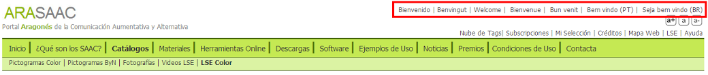
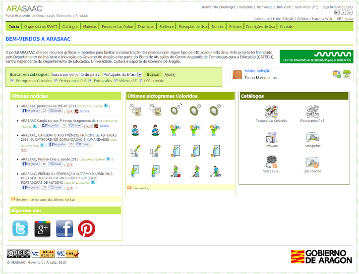
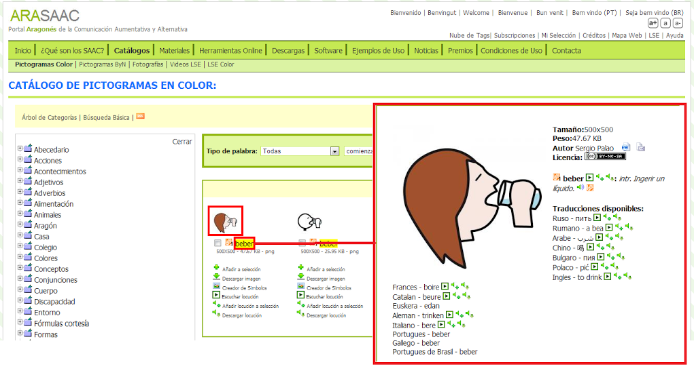

# 7.3 Traducciones

Dentro del tema de las traducciones tenemos que diferenciar entre la **traducción del portal** y la **traducción del diccionario de acepciones** de ARASAAC.

La interfaz del portal está traducida a **6 idiomas** además del castellano.

La navegación por el portal en cualquiera de los idiomas disponible implica que todos los contenidos del portal se muestran en el idioma seleccionado y que las herramientas y buscadores se configuran automáticamente al idioma seleccionado.

Además de la traducción a seis idiomas del portal, se dispone de traducciones del diccionario de acepciones de ARASAAC a **15 idiomas**: Ruso, Búlgaro, Árabe, Chino, Rumano, Polaco, Inglés, Francés, Alemán, Italiano, Portugués, Portugués de Brasil, Catalán, Euskera y Gallego.

Para acceder a las traducciones basta con pulsar sobre la imagen o sobre el nombre en los resultados de las búsquedas o en la vista de cada uno de los catálogos.

Una vez dentro de la ficha, si la palabra tiene traducciones en todos o en algunos de los quince idiomas, se listarán y podremos, tan solo seleccionando, copiando y pegando el texto del idioma que nos interese, insertarlo en cualquier otro programa como, por ejemplo, Word.

