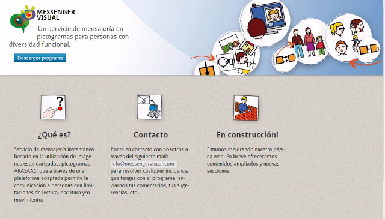
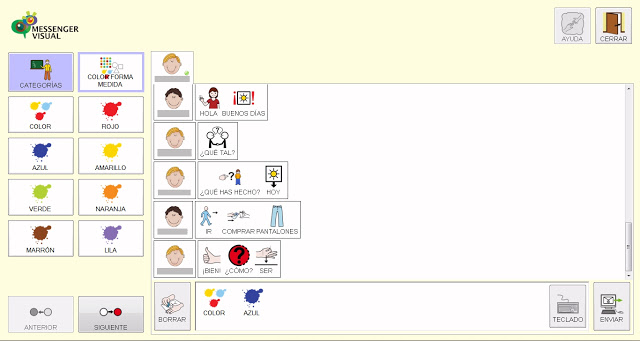

# Ampliación de contenidos

## ParaSaberMas

## PICTOCUENTOS

Fig. 3.69 Captura de la Web de PictoCuentos [http://www.pictocuentos.com/](http://www.pictocuentos.com/)

[Pictocuentos](http://www.pictocuentos.com/)forma parte de una serie de aplicaciones desarrolladas con el fin de ayudar apersonas que tienen dificultades de expresión mediante el lenguaje oral y que se comunican más eficientemente mediante imágenes.Los cuentos se presentan conanimaciones, música y locuciones muy cuidadas, junto con los pictogramasdeARASAACcorrespondientes a la narración, de tal forma que los usuarios pueden comprender y leer el cuento con imágenes a la vez que lo visualizan.

Fig. 3.70 Captura de una de las páginas de Ricitos de Oro obtenida de la web [http://www.pictocuentos.com/](http://www.pictocuentos.com/) 

Como indican sus autores,"partiendo de la motivación que suscita el mundo de los cuentos, y ayudándonos de pictogramas, podemos ayudar a las personas a comprender mejor su entorno así como estimular y ejercitar todos los aspectos relacionados con el lenguaje".

## PICTOJUEGOS

Fig. 3.71 Captura de la Web de PictoJuegos [http://www.pictojuegos.com/](http://www.pictojuegos.com/) 

[Pictojuegos](http://www.pictojuegos.com/)forma parte de una serie deaplicaciones desarrolladas con el fin de ayudar a personas que tienen dificultades de expresiónmediante el lenguaje oral y que se comunican más eficientemente mediante imágenes.

Los autores parten de la<strong style="text-align: justify;">motivación que suscita el mundo de los juegos,y ayudándonos de pictogramas, podemos ayudar a las personas a comprender mejor su entorno así como estimular y ejercitar todos los aspectos relacionados con el lenguaje.

Para ello, nos sorprenden con cuatro juegos fantásticos:

<strong style="text-align: left;">[Memory](http://www.pictojuegos.com/memory/): Juego de memoria clásico orientado a la comprensión, reconocimiento y discriminación de emociones a través de la unión de parejas iguales de pictogramas de ARASAAC, que se complementan con la reproducción en cada acierto, de la animación de cada emoción que se ha conseguido emparejar, con el fin de incentivar su comprensión.

|Fig. 3.72 Captura del juego Memory obtenido de la web [http://www.pictojuegos.com/memory/](http://www.pictojuegos.com/memory/) 

Fig. 3.73 Captura del juego Emociones obtenido de la web [http://www.pictojuegos.com/emociones/](http://www.pictojuegos.com/emociones/) 

Fig. 3.74 Captura del juego Acciones obtenido de la web [http://www.pictojuegos.com/acciones/](http://www.pictojuegos.com/acciones/) 

Fig. 3.75 Captura del juego PequePuzzle obtenido de la web [http://www.pictojuegos.com/puzzle/](http://www.pictojuegos.com/puzzle/) 

## MESSENGER VISUAL

El[Messenger Visual](http://www.messengervisual.com/)consiste en unservicio de mensajería instantáneabasado en la utilización de imágenes estandarizadas,[pictogramas ARASAAC](http://arasaac.org/), que a través de una plataforma adaptada permite la comunicación a personas con limitaciones de lectura, escritura y/o movimiento.

Fig. 3.76 Chat de mensajería instántanea con pictogramas de ARASAAC -  [Messenger Visual](http://www.fundmaresme.com/)

El[Messenger Visual](http://www.messengervisual.com/)viene a cubrir un vacío en el ámbito delocioy accesibilidad de internet para las personas con diversidad funcional yque no pueden comunicarse a través de la escritura y, por lo tanto, mantener una conversación en la red con un amigo o con un familiar.

Fig. 3.77 Captura de una conversación con pictogramas utilizando  [Messenger Visual](http://www.fundmaresme.com/)

