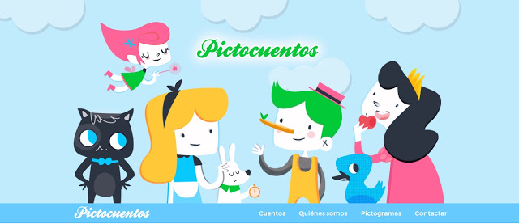
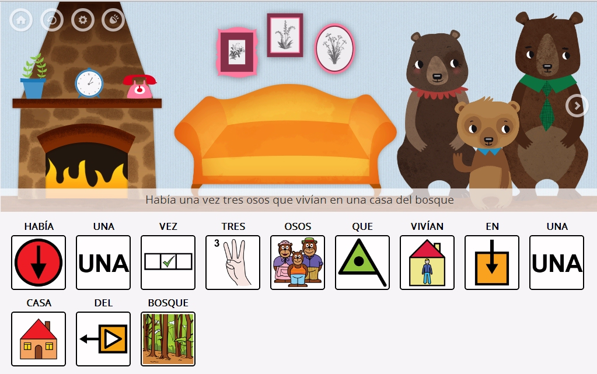
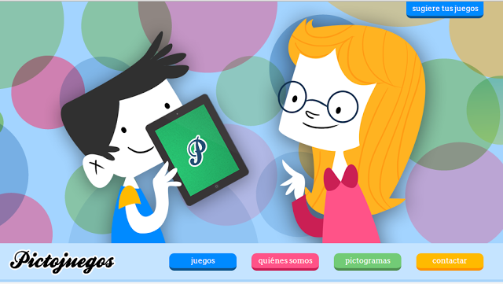
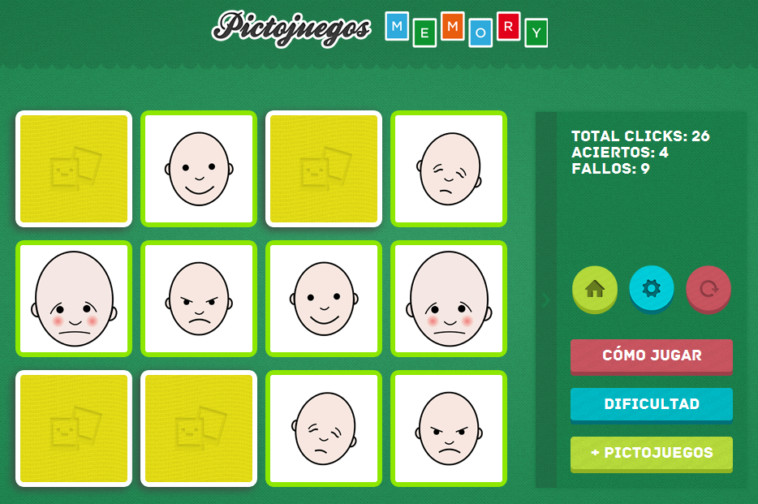
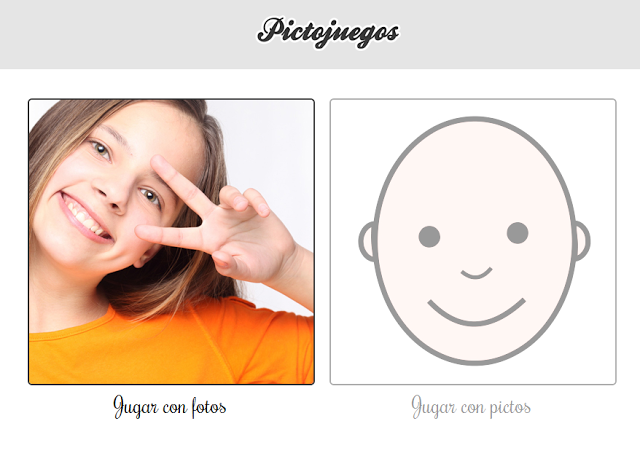
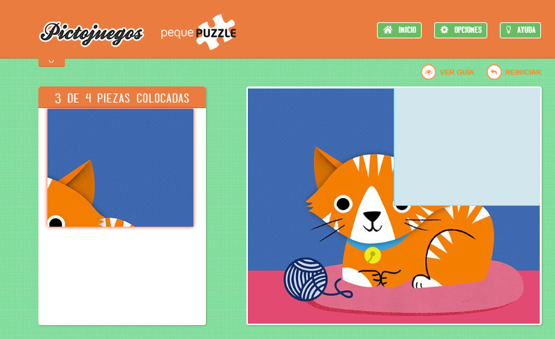

# Ampliación de contenidos

## Para Saber Más

## PICTOCUENTOS

[**Pictocuentos**](http://www.pictocuentos.com/) forma parte de una serie de aplicaciones desarrolladas con el fin de ayudar a **personas que tienen dificultades de expresión mediante el lenguaje oral y que se comunican más eficientemente mediante imágenes**.

Los cuentos se presentan con **animaciones, música y locuciones muy cuidadas, junto con los pictogramasdeARASAAC** correspondientes a la narración, de tal forma que los usuarios pueden comprender y leer el cuento con imágenes a la vez que lo visualizan.

Como indican sus autores,"partiendo de la motivación que suscita el mundo de los cuentos, y ayudándonos de pictogramas, podemos ayudar a las personas a comprender mejor su entorno así como estimular y ejercitar todos los aspectos relacionados con el lenguaje".

## PICTOJUEGOS

[Pictojuegos](http://www.pictojuegos.com/) forma parte de una serie de **aplicaciones desarrolladas con el fin de ayudar a personas que tienen dificultades de expresión** mediante el lenguaje oral y que se comunican más eficientemente mediante imágenes.

Los autores parten de la **motivación que suscita el mundo de los juegos**, y ayudándonos de pictogramas, podemos ayudar a las personas a comprender mejor su entorno así como estimular y ejercitar todos los aspectos relacionados con el lenguaje.

Para ello, nos sorprenden con cuatro juegos fantásticos:

[**Memory**](http://www.pictojuegos.com/memory/): Juego de memoria clásico orientado a la comprensión, reconocimiento y discriminación de emociones a través de la unión de parejas iguales de pictogramas de ARASAAC, que se complementan con la reproducción en cada acierto, de la animación de cada emoción que se ha conseguido emparejar, con el fin de incentivar su comprensión.

[Emociones](http://www.pictojuegos.com/emociones/): A elección del usuario y través de pictogramas ARASAAC e imágenes reales, el usuario tiene que acertar que imagen aleatoria corresponde a la locución de voz que escuchan y al texto que aparece en cada pantalla.

[Acciones](http://www.pictojuegos.com/acciones/): Pensada para trabajar en pantalla completa con personas que tienen parálisis cerebral, se ha desarrollado un juego que reproduce acciones básicas asociadas a los personajes de los pictogramas de ARASAAC donde el usuario al ir pulsando en pantalla para avanzar desencadena la animación correspondiente a cada pictograma.

[Pequepuzzle](http://www.pictojuegos.com/puzzle/): Pensado para los más peques. A través de puzzles de animales se trabaja la memoria visual. Dispone de distintos grados de dificultad, varias opciones y una guía fácil de cada puzzle para facilitar su realización.Al acabar el puzzle correctamente, los peques ven como se reproduce la secuencia de texto de la imagen que han creado, así como pueden escuchar la locución de voz y el sonido que hace cada animal para facilitar la comprensión de cada imagen.

## MESSENGER VISUAL

El[Messenger Visual](http://www.messengervisual.com/)consiste en un **servicio de mensajería instantánea** basado en la utilización de imágenes estandarizadas, [pictogramas ARASAAC](http://arasaac.org/), que a través de una plataforma adaptada permite la comunicación a personas con limitaciones de lectura, escritura y/o movimiento.

El [Messenger Visual](http://www.messengervisual.com/) viene a cubrir un vacío en el ámbito del **ocio y accesibilidad de internet para las personas con diversidad funcional** yque no pueden comunicarse a través de la escritura y, por lo tanto, mantener una conversación en la red con un amigo o con un familiar.

