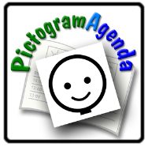
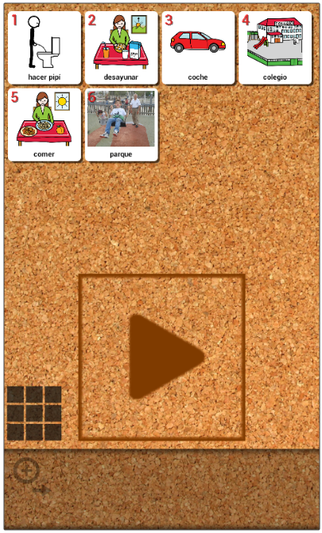

# Ampliación de contenidos

## ParaSaberMas

## Pictoagenda

**[Pictoagenda](http://www.pictoagenda.com/)** es un herramienta online que forma parte de la suite de **[Pictoaplicaciones](http://www.pictoaplicaciones.com/)**, y cuyo objetivo es crear una agenda para establecer las actividades y rutinas de cada día a través de imágenes (pictogramas de **[ARASAAC](http://arasaac.org/)**) y acompañadas de gráficos que marcan el proceso de organización y cumplimiento en el día de dichas actividades y rutinas.

<td style="text-align: center;"><pre>Fig. 4.18 Logo de PictoAgenda - [http://www.pictoaplicaciones.com/](http://www.pictoaplicaciones.com/) </pre></td>

La comunicación visual, a través de la agenda, ayuda a procesar y organizar mentalmente todas las actividades diarias en el  espacio y en el tiempo, haciendo con ello que se **anticipen los acontecimientos y evitando ansiedad o conductas inadecuadas** por la incomprensión de dichas actividades.

Para ampliar información de cómo utilizar la herramienta se puede consultar la entrada del Blog de ARASAAC ([http://blog.arasaac.org/2013/06/pictoagenda-nueva-y-fantastica.html](http://blog.arasaac.org/2013/06/pictoagenda-nueva-y-fantastica.html)) que se creó con motivo de su lanzamiento.

## PictogramAgenda

PictogramAgenda es una aplicación informática que facilita la generación y uso de agendas visuales en terminales (teléfonos móviles o tablets) basados en el sistema operativo **Android**.

<td style="text-align: center;"><pre>Fig. 4.20 Logotipo de PictogramAgenda - http://www.lorenzomoreno.com</pre></td>

PictogramAgenda permite configurar y ordenar una secuencia de imágenes (máximo 12) que formarán la agenda visual.

<td style="text-align: center;"><pre>Fig. 4.21 Diferentes capturas de pantalla del programa PictogramAgenda</pre></td>

## In-TIC Agenda

In-TIC Agenda es una aplicación para Windows que permite crear rápidamente agendas que facilitan la consulta diaria de actividades o tareas y el poder trabajar con ellas de forma dinámica sobre el ordenador.

Esta aplicación emula el comportamiento de las agendas convencionales (pared, mesa, velcros...), de manera que los usuarios puedan completar su agenda y estructurar las actividades que realizan durante su vida diaria. El programa permite crear rápidamente diferentes actividades (asociadas a secuencias de pictogramas) que conforman la agenda (diaria, semanal o libre) que se puede consultar o bien trabajar con ella construyéndola de forma dinámica sobre el ordenador.

<iframe width="425" height="319" src="http://www.proyectosfundacionorange.es/intic/videotutoriales/Usuarios_de_ejemplo.mp4"></iframe>

Podéis consultar más videotutoriales en la web del proyecto: [http://www.proyectosfundacionorange.es/intic/intic_agenda/videotutoriales.php](http://www.proyectosfundacionorange.es/intic/intic_agenda/videotutoriales.php)

descargar el manual desde: [http://documents.mx/documents/manualusointicagendapdf.html](http://documents.mx/documents/manualusointicagendapdf.html)

y descargar la aplicación desde su web: [http://www.proyectosfundacionorange.es/intic/intic_agenda/](http://www.proyectosfundacionorange.es/intic/intic_agenda/)

 

