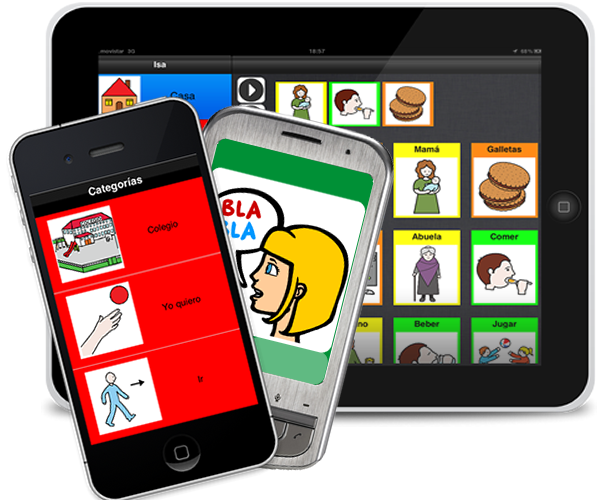
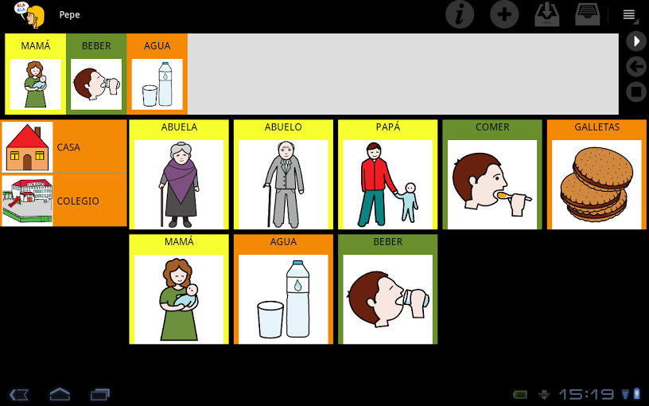
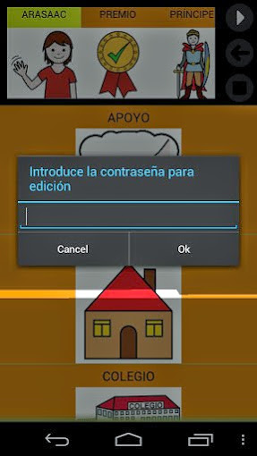
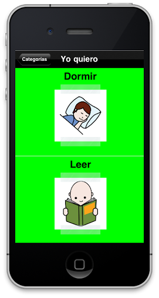

# Comunicador CPA

## Para Saber Más

El [Comunicador Personal Adaptable](http://www.comunicadorcpa.com/) (CPA) es un sistema de comunicación para personas con problemas graves de comunicación (autismo, trastornos neurológicos, discapacidades motoras, afasia).

En todas las versiones del comunicador CPA, se utilizancategorías como punto de partida, a partir de las cuales seleccionaremos el pictograma o la imagen deseada. Existen dos versiones para el S.O. iPad y para el S.O. Android con frase acumulada. Por tanto, se trata de un comunicador avanzado para niños o adultos con un alto nivel de comunicación funcional.

Actualmente están disponibles las siguientes versiones:

Para conocer **información adicional** acerca del programa puedes visitar la web de los desarrolladores [http://www.comunicadorcpa.com/](http://www.comunicadorcpa.com/), su página en Facebook con las últimas noticias sobre las aplicaciones ([https://www.facebook.com/ComunicadorPersonalAdaptable](https://www.facebook.com/ComunicadorPersonalAdaptable))y visualizar la presentación en PREZI adjunta a continuación.

<iframe src="http://prezi.com/embed/jcpr9qcmcnr-/?bgcolor=ffffff&amp;lock_to_path=0&amp;autoplay=0&amp;autohide_ctrls=0&amp;features=undefined&amp;disabled_features=undefined" frameborder="0" width="550" height="400"></iframe>

