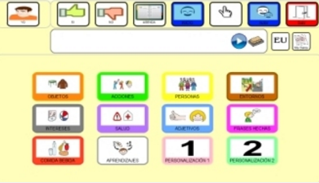
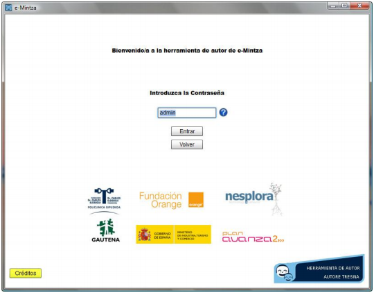

# Emintza

## Para Saber Más

[e-Mintza](http://www.fundacionorange.es/aplicaciones/e-mintza/) es un sistema personalizable y dinámico de comunicación aumentativa y alternativa dirigido a personas con autismo o con barreras de comunicación oral o escrita.

Permite al usuario comunicarse con otras personas mediante el uso de tecnología táctil y multimedia, adaptándose fácilmente a las necesidades de sus usuarios. Asimismo promueve su autonomía a través de una agenda personalizada.

Actualmente están disponibles versiones para Windows, Mac y Android. Para obtener información adicional y las diferentes versiones  visitar la página del proyecto [http://www.fundacionorange.es/aplicaciones/e-mintza/](http://www.fundacionorange.es/aplicaciones/e-mintza/)

