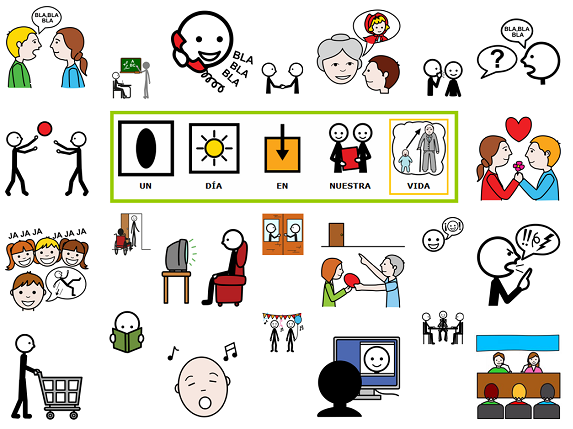
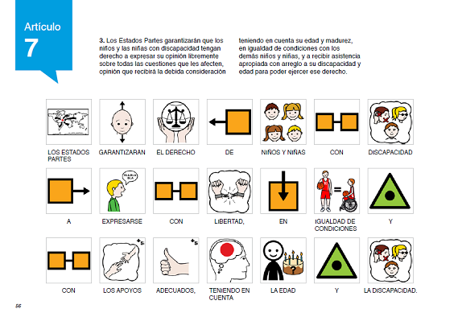

# M1: Nos comunicamos con Pictogramas

**Introducción del módulo**

Mira unos instantes&nbsp; esta lámina y analiza su contenido.

<td style="text-align: center;"><pre>Fig 1.1"Un día en nuestra vida" - **Autores:** José Manuel Marcos y David Romero **Licencia:** CC (BY-NC-SA)&nbsp;</pre></td>

Hablar con los amigos de la cena de ayer, contar una historia o un chiste divertido, responder a preguntas sobre cómo fue el partido, ver nuestro concurso favorito o el telediario en la tele, reírrnos por alguna anécdota que nos ha acontecido recientemente, saludar en el ascensor o en la calle a un vecino, chatear con un familiar que trabaja en otro país, hacer la compra en el supermercado, etc., etc., etc. Podríamos seguir a&ntilde;adiendo multitud de acciones que tienen un nexo com&uacute;n: la comunicación.&nbsp;

Ahora vamos a ver un vídeo realizado con pictogramas&nbsp;[AIGA](http://es.wikipedia.org/wiki/AIGA)&nbsp;(los que vemos en los aeropuertos) en los que estos cobran vida y representan de un modo divertido un día cualquiera en nuestra vida.
|<iframe src="//player.vimeo.com/video/21462452" frameborder="0" width="500" height="300"></iframe>
|<pre>[UN DIA DE MI VIDA](http://vimeo.com/21462452)&nbsp;from&nbsp;[raquel](http://vimeo.com/user6398784)&nbsp;on&nbsp;[Vimeo](https://vimeo.com).&nbsp;</pre>

Por definición, todas las formas de comunicación requieren de un&nbsp;[emisor](http://es.wikipedia.org/wiki/Emisor), un&nbsp;[mensaje](http://es.wikipedia.org/wiki/Mensaje)&nbsp;y un&nbsp;[receptor](http://es.wikipedia.org/wiki/Receptor_(comunicaci%C3%B3n)). Incluso, en algunas ocasiones, el receptor no necesita estar presente ni consciente del intento comunicativo por parte del emisor para que el acto de comunicación se realice.

Nuestra vida diaria está llena de momentos de recibir o compartir información.&nbsp;

Pero &iquest;qué sucede cuando alguien quiere expresarnos una necesidad, un deseo o contarnos su experiencia y no puede hacerlo porque no tiene los medios adecuados para emitir un mensaje?&nbsp;

En estos tiempos en los que nos inundan las nuevas tecnologías, &iquest;has pensado alguna vez qué sucedería si nuestra operadora de móvil o de Internet dejará de facilitarnos el servicio durante 24 horas? O &iquest;48 horas? O &iquest;una semana? No es mucho tiempo, pero reflexiona un momento sobre las consecuencias que tendría peque&ntilde;o incidente en tu vida diaria.&nbsp;

Hay personas que, por distintas circunstancias y en determinados momentos de su vida, tienen dificultades para utilizar las formas más básicas de la comunicación, las que le van a permitir interaccionar y modificar su entorno más inmediato. Pedir un vaso de agua o un refresco, rechazar una comida porque note &nbsp;gusta, expresar un dolor intenso en alguna parte de tu cuerpo, participar en un juego con otras personas, &hellip;, se convierten en barreras cada vez más altas para ellos si no ponemos los medios adecuados para que puedan superarlas.

No debemos olvidarnos de que **&ldquo;la comunicación es un derecho para todas las personas&rdquo;** y así lo recoge la ****&ldquo;CONVENCI&Oacute;N SOBRE LOS DERECHOS DE LAS PERSONAS CON DISCAPACIDAD&rdquo;** de las Naciones Unidas,&nbsp; en su artículo 7.&nbsp;

([http://www.un.org/esa/socdev/enable/documents/tccconvs.pdf](http://www.un.org/esa/socdev/enable/documents/tccconvs.pdf))&nbsp;

<td align="center"><pre>Fig 1.2 Captura del art. 7 de la Convención de Derechos de Personas con Discapacidad traducida a pictogramas</pre><pre>**Autor: **[**CEAPAT**](http://www.ceapat.es/ceapat_01/centro_documental/tecnologiasinformacion/sistemas_comunicacion_aumentativa/IM_035263)</pre></td>

Y para finalizar os querríamos dejar un vídeo en el que puede verse un ejemplo de como los Sistemas Aumentativos y Alternativos de Comunicación facilitan la comunicación a personas con alguna dificultad en este área permitiendo su inclusión plena en la sociedad.&nbsp;
<td style="text-align: center;"><object type="application/x-shockwave-flash" data="flowPlayer.swf" width="560" height="315"><param name="exe_flv" value="http://aularagon.catedu.es/materialesaularagon2013/arasaac/Videos/Buscando_la_accesibilidad_total_en_la_comunicaci_n_FEAPS_on_.flv"></param><param name="allowfullscreen" value="true"></param><param name="allowscriptaccess" value="true"></param><param name="src" value="http://aularagon.catedu.es/materialesaularagon2013/arasaac/Videos/Buscando_la_accesibilidad_total_en_la_comunicaci_n_FEAPS_on_.flv"></param><param name="flashvars" value="config={'playlist': [ { 'url': 'http%3A//aularagon.catedu.es/materialesaularagon2013/arasaac/Videos/Buscando_la_accesibilidad_total_en_la_comunicaci_n_FEAPS_on_.flv', 'autoPlay': false, 'autoBuffering': true } ] }"></param></object></td>
<td style="text-align: center;"><pre>Video realizado por la Asociación Probosco (miembro de FEAPS Canarias), que ilustran una buena práctica titulada:"Buscando la accesibilidad total en la comunicación. Un compromiso de todos"</pre></td>

## ParaSaberMas

Para más información sobre la convención:&nbsp;

[http://www.un.org/spanish/disabilities/](http://www.un.org/spanish/disabilities/)

## Objetivos

Los objetivos que se pretenden alcanzar en este módulo son:

- Alcanzar unas nociones básicas sobre** Sistemas Aumentativos y Alternativos de Comunicación **(SAACs).
- Conocer el** origen **del Portal Aragonés de la Comunicación Aumentativa y Alternativa** ARASAAC **y su** evolución **como SAAC.
- Conocer las distintas** secciones del portal **para la obtención de recursos e información: catálogos, descargas, software, ejemplos de uso, &nbsp;licencia, etc.

**Contenidos**

Este módulo se divide en las siguientes unidades:

-** Unidad 1:**&nbsp;Bases de la Comunicación Aumentativa y Alternativa.
- **Unidad 2:&nbsp;**Barreras en la comunicación funcional.
-** Unidad 3:**&nbsp;Conocimiento de diferentes sistemas de comunicación aumentativa y alternativa (SAAC).
- **Unidad 4:**&nbsp;Los pictogramas como SAAC: usuarios, características y utilidades.
-** Unidad 5:**&nbsp;Productos de apoyo específicos para la comunicación aumentativa y alternativa (CAA): tableros y libros de comunicación.
- **Unidad 6:**&nbsp;ARASAAC como SAAC: origen, evolución e idiosincrasia.
-** Unidad 7:**&nbsp;El Portal Aragonés de la Comunicación Aumentativa y Alternativa ARASAAC: recursos y materiales disponibles.&nbsp;

