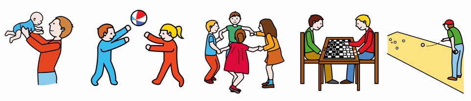
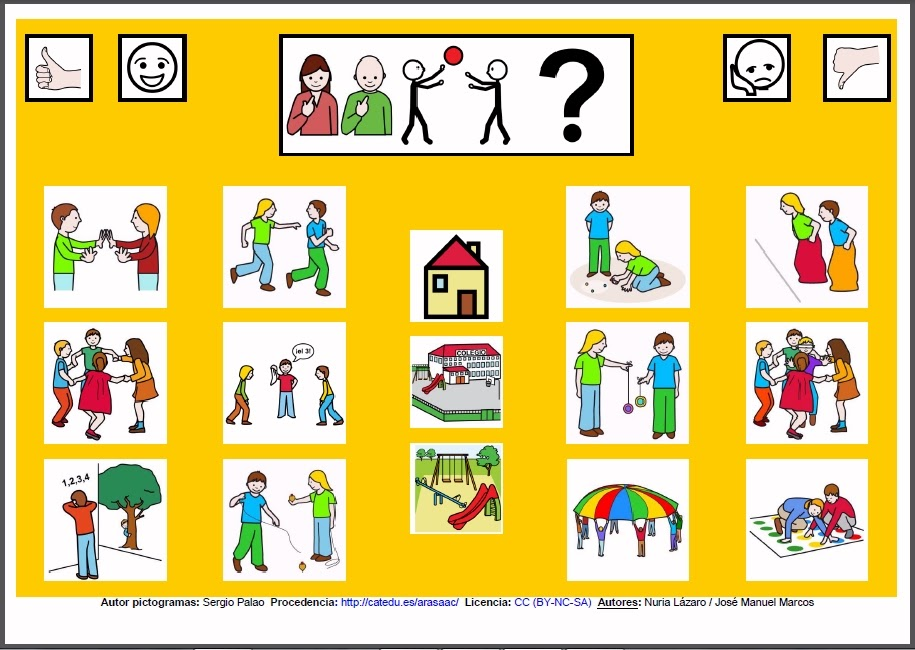
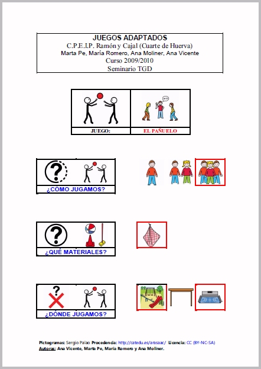
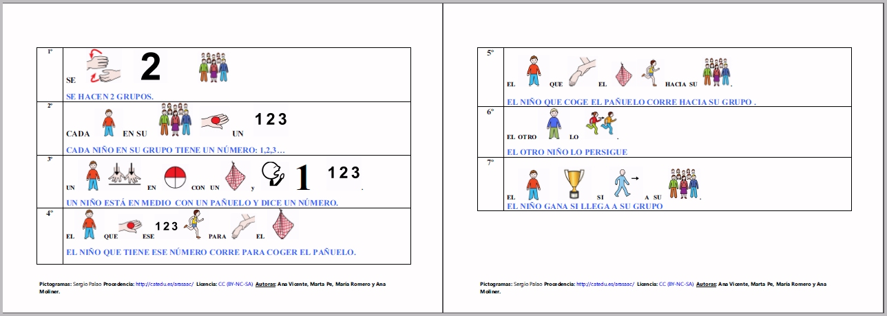

# M3: Jugamos y nos divertimos con pictogramas

Introducción del módulo

El juego es una de las actividades más primarias que desarrolla el ser humano desde las primeras etapas de su vida yuna de las actividades más importantes en la edad infantil. Los niños no solo utilizan el juego para divertirse, sino que también lo hacen para estimular su desarrollo intelectual, desarrollar su creatividad, aprender a controlar su propio cuerpo, expresar emociones y favorecer la socialización.

Todo el mundo coincide en la necesidad del juego como fuente de crecimiento, aprendizaje y socialización y, por lo tanto, como una vía mediante la cual el niño ensaya la forma de actuar ante el mundo.

Fig. 3.1"Diferentes etapas del juego a lo largo de nuestra vida"Pictogramas: ARASAAC Licencia: CC BY-NC-SA

Su importancia es tal que elArtículo 31de laConvención de los Derechos de niños y niñas(adoptada por la asamblea general de las Naciones Unidas, el 20 de noviembre de 1989) recoge:"Se reconoce el derecho del niño al descanso y al esparcimiento, al juego y a las actividades recreativas propias de su edad y a participar libremente en la vida cultural y en las artes. Se respetarán y promoverán el derecho del niño a participar plenamente en la vida cultural y artística y se propiciarán oportunidades apropiadas, en condiciones de igualdad, de participar en la actividad cultural, artística, recreativa y de esparcimiento".

Evidentemente, la comunicación juega un papel muy importante en este tipo de actividad y las barreras en la comunicación impiden, en muchas ocasiones, que las personas tomen parte activa en juegos y actividades de ocio con sus compañeros o amigos. Por lo tanto, los profesionales y las familias deberemos tomar las medidas compensatorias adecuadas para eliminar esta barrera y dirigir nuestras actuacionestanto a la persona como a su entorno, incluyendo a todas las personas y todos los contextos donde pueden desarrollarse estas actividades lúdicas.

Este tipo de medidas compensatorias que deberemos adoptar, entre otras, en el área de comunicación para conseguir la participación plena de todas las personas deberán ir dirigidas a la adaptación del propio juego con pictogramas, la utilización de carteles explicativos de las reglas básicas del mismo, la creación de rutinas o guiones sociales que sirvan de anticipación sobre la participación y la elaboración de tableros o libros de comunicación, que permitan expresar cualquier emoción, deseo o necesidad para conseguir su plena inclusión en la actividad.

Fig. 3.2 [Tablero de comunicación](http://informaticaparaeducacionespecial.blogspot.com.es/p/tableros-de-comunicacion.html) de 12 casillas para la elección del juego cooperativo en el que queremos participar.Autores: José Manuel Marcos y Nuria Lázaro Licencia: CC BY-NC-SA

A continuación, podemos ver en la imagen inferior una adaptación con pictogramas de ARASAAC del"Juego del pañuelo".

Fig. 3.3 Presentación con pictogramas de los elementos necesarios para jugar al"[Juego del pañuelo](http://arasaac.org/materiales.php?id_material=225)"Autores: Ana Vicente, Ana Moliner, María Romero y Marta Pe Licencia: CC BY-NC-SA

Tras la presentación de todos los elementos (participantes, materiales y espacios), podemos visualizar las reglas adaptadas con pictogramas para conseguir la plena participación de todos.

Fig. 3.4 Reglas básicas adaptadas con pictogramas para jugar al"[Juego del pañuelo](http://arasaac.org/materiales.php?id_material=225)"Autores: Ana Vicente, Ana Moliner, María Romero y Marta Pe Licencia: CC BY-NC-SA

De esta forma, además de la inclusión, conseguiremos que el juego sea una experiencia muy positiva para todos y, sobre todo, divertida y lúdica.

Las actividades de ocio también forman una parte importante de nuestra vida personal y social. La aparición de los pictogramas ARASAAC ha favorecido la adaptación con pictogramas de distintas actividades que también nos ayudan a desarrollarnos plenamente como personas y como integrantes de la sociedad en la que vivimos.

Una de las actividades que más auge ha tenido a lo largo de estos años ha sido la adaptación a pictogramas de vídeos con canciones famosas de los artistas más reconocidos o de películas infantiles, que nos puede servir para utilizarlos como karaoke y potenciar el refuerzo del lenguaje oral en una actividad de ocio muy concreta.

A continuación, podemos observar un ejemplo de adaptación con pictogramas de ARASAAC de una de las canciones de la película"El rey León".

https//www.youtube.com/watch?v=pQqRdfhdPRY
Pero las adaptaciones han ido más allá de la música y, en estos momentos, los profesionales y las familias han apostado por utilizar los sistemas de comunicación en otros campos que, hace años, hubiera resultado impensable. Aquí podemos visualizar un anuncio con pictogramas.

https//www.youtube.com/watch?v=zoJ0Cq8L5S8

Os invitamos a reflexionar sobre situaciones de nuestra vida cotidiana en las que las personas con dificultades en la comunicación encuentran barreras que dificultan su plena integración. A modo de ejemplo, podéis visitarnuestro apartado de[Ejemplos de uso](http://arasaac.org/ejemplos_uso.php), donde encontraréis más situaciones en las que se han realizado adaptaciones de todo tipo, cuyo objetivo es mejorar la calidad de vida de todas las personas. Pero no nos engañemos, todavía queda mucho por hacer y es fundamental que todos -profesionales, familias e instituciones- participemos conjutnamente en esta labor.

## ParaSaberMas

Para conocer como conformar la conducta del juego paso a paso en personas con autismo, es muy recomendable la lectura de[El libro del juego](http://arasaac.org/materiales.php?id_material=297), En este libro, Anabel Cornago ([El sonido de la hierba al crecer](http://elsonidodelahierbaelcrecer.blogspot.com/)) nos muestra todos los ejercicios y estrategias que ha seguido con su hijo Erik para lograr interacción, juego funcional, atención compartida, juego de reglas, juego con otros niños, juego símbólico, modificación de conductas inadecuadas y de estereotipias, así como habilidades sociales. En el libro, aparecen enlazados muchos materiales que Anabel ya ha compartido con el portal ARASAAC.

Podéis encontrar más vídeos de canciones subtituladas con pictogramas de ARASAAC en Youtube buscando por los términos clave:["Canciones ARASAAC"](http://www.youtube.com/results?search_query=canciones+arasaac)o["Canciones con pictogramas"](http://www.youtube.com/results?search_query=canciones+con+pictogramas&amp;oq=canciones+con+pictogramas&amp;gs_l=youtube.3..0l4.84.5783.0.5925.30.21.2.7.7.0.138.2178.7j14.21.0...0.0...1ac.1.11.youtube.26t6Ela8sD8).

Para ver otros anuncios adaptados con pictogramas os recomendamos visitar el perfil de [CarmenPi ](http://www.youtube.com/user/carmenpi100)en Youtube.

## Objetivos

Los objetivos que se pretenden alcanzar en este módulo son:

- Manejar de modo práctico los distintos sistemas de búsqueda de recursos gráficos (pictogramas, fotografías y videos en LSE) para la elaboración de materiales de Comunicación Aumentativa y Alternativa (CAA) y adaptaciones curriculares.
- Manejo práctico de los sistemas de búsqueda de materiales elaborados por los propios usuarios, en función de distintas variables: tipo, nivel curricular, usuarios, idioma, etc.
- Acceso a las herramientas online del portal y a sus carpetas asociadas: "Mi selección" y "Carpeta de trabajo".
<li>Elaboración de materiales con las herramientas online disponibles en el portal:
<ul>
- Creador de Animaciones,
- Creador de Símbolos,
- Creador de Frases,
- Generador de Horarios,
- Generador de Calendarios,
- Generador de Tableros (quizá no sea necesario explicarla)
- Generador de Bingos ydominós
- Generador de Juego de la Oca.

Contenidos

El módulo se divide en los siguientes unidades:

- Unidad 1:Importancia del Juego
- Unidad 2:Utilización de los diferentes sistemas de búsqueda de recursos gráficos en el portal ARASAAC: búsqueda inicial y en los diferentes catálogos.
- Unidad 3:Adición de recursos gráficos a la carpeta "Mi selección" para su utilización en la elaboración de materiales con las herramientas on line disponibles en el portal.
- Unidad 4:Importación de recursos gráficos propios a la "Carpeta de trabajo", con el mismo fin.
- Unidad 5:Generador de Bingos.
- Unidad 6:Generador del Juego de la Oca.
- Unidad 7:Generador de Dominós
- Unidad 8:Generador de Dominós encadenados.
- Unidad 9:Creador de Animaciones.
- Unidad 10:Creador de Frases.

