# M4: Nos organizamos en el tiempo y señalizamos nuestro entorno

### NOS ORIENTAMOS EN EL ESPACIO

Una de las experiencias más estresantes que acontece cuando nos encontramos en un entorno que no es habitual para nosotros es la sensación de inseguridad que nos invade al tenernos que desplazar de un lugar a otro, incluso acompañados del plano en la mano. Normalmente, leeremos los nombres de las calles en el plano, veremos si coinciden con los postes de señalización vertical,  nos fijaremos en algún lugar de referencia y empezaremos a caminar hacia allí. Como último recurso, siempre podemos preguntars a los viandantes en el caso de que nos perdamos.

Esta sensación se agrava en lugares muy transitados, con gran cantidad de gente, con letreros en un idioma desconocido y con estímulos visuales y sonoros que nos abruman. Seguro que, enseguida, os vendrá al pensamiento la experiencia"vivida" en un aeropuerto como Madrid, Barcelona, París, Londres, New York,... 

El desconcierto inicial ante tanta información da paso a la búsqueda ansiosa de alguna referencia que nos ayude a situarnos. Es entonces cuando toman vida a los pictogramas que"decoran" estos espacios, comunicándonos una valiosa información que, en último término, nos ayuda a coger nuestro vuelo a tiempo.

Este vídeo es un ejemplo de cómo"viven" es situación los pictogramas que habitualmente nos sirven de guía.

https//www.youtube.com/watch?v=u9wBHSxQL-0
Para todos nosotros estos pictogramas nos resultan familiares porque, desde muy pequeños, los hemos visto en muchos lugares por los que hemos transitado: estaciones, hospitales, centros comerciales,... 

Tienen un carácter internacional y están estandarizados, siguiendo normas ISO (como por ejemplo la ISO 9186-1. referente a la comprensión de los pictogramas) o AENOR. Algunos ejemplos de estos sistemas de pictogramas internacionales son el [AIGA](http://es.wikipedia.org/wiki/Pictogramas_del_Departamento_de_Transporte_de_los_Estados_Unidos), [Isotype](http://en.wikipedia.org/wiki/Isotype_(picture_language)) o [ERCO](http://www.erco.com/service/press-release/company-3/pictograms-quickly-comprehended_2403/es/).

Pero hay algunas personas para las que estos sistemas pictográficos de señalización no son comprensibles dadas sus características de diseño y porque no abarcan todos los entornos donde se desenvuelven, sino sólo algunos espacios algunos públicos. 

Por esta razón, actualmente existe una corriente que aboga por una señalización complementaria a la tradicional que facilite la accesibilidad cognitiva en todos los espacios privados y públicos en los que desenvuelven las personas para las que la comunicación se convierte en una barrera inaccesible.. 

En esta línea, distintas instituciones, fundaciones o ayuntamientos como los de Málaga, Zaragoza, Comarcas de Cambados, etc, están realizando un gran esfuerzo en hacer accesibles estos espacios, utilizando los pictogramas de ARASAAC. 

También son muchos los centros educativos de distintos niveles que están señalizando sus instalaciones para facilitar la integración de todas las personas.

Veamos algunos ejemplos en la siguiente galería de imágenes:

## Galería de imágenes

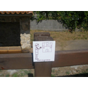
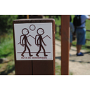
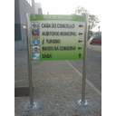
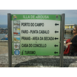

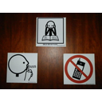
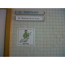
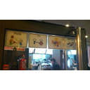
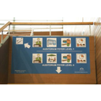
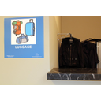
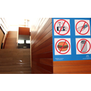
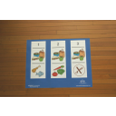
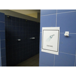
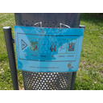

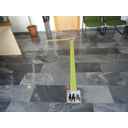
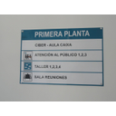
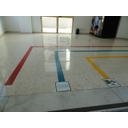
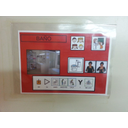
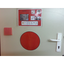
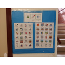
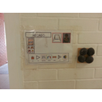
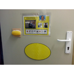
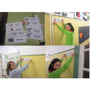
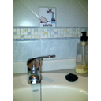
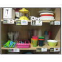

## Importante

En el catálogo de [Ejemplos de Uso de ARASAAC](http://arasaac.org/ejemplos_uso.php?busqueda=basico&amp;buscador=2&amp;id_tipo_eu=2&amp;pg=0) podéis ver algunas de estas experiencia de uso de los pictogramas para mejorar la accesibilidad cognitiva a los espacios públicos y privados.

[http://arasaac.org/ejemplos_uso.php?busqueda=basico&amp;buscador=2&amp;id_tipo_eu=2&amp;pg=0](http://arasaac.org/ejemplos_uso.php?busqueda=basico&amp;buscador=2&amp;id_tipo_eu=2&amp;pg=0)

### NOS ORGANIZAMOS EL TIEMPO

Nuestro ritmo de vida actual nos obliga a utilizar gran cantidad de apoyos visuales que nos ayudan a organizar nuestro tiempo de forma más precisa y eficaz. Agendas en papel o electrónicas, post its en la nevera o en la pantalla del ordenador, calendarios on line y un montón de recursos son muy familiares y casi imprescindibles en nuestra vida cotidiana.

Resulta difícil que nos olvidemos del cumpleaños de un familiar, de una reunión importante o de una cena con los amigos. No debemos preocuparnos; nuestro smartphone o nuestras redes sociales nos advertirán de ello.

Al igual que en el caso de la orientación espacial, éste es otro de los ámbitos donde la personas con dificultades en la comunicación van a necesitar apoyos visuales muy concretos para organizar las rutinas de cualquier acción que deben ejecutar y para anticipar todas las actividades a realizar durante un periodo concreto.

Este tipo de apoyos (fotografías, imágenes o pictogramas)nos resultarán de mucha ayuda para mostrar ordenadamente las distintas actividades a realizar, rutinarias o excepcionales, y evitar así el desconcierto de la persona, puesto que podrá acceder a una noción más precisa del orden en el que se desarrollan. Incluso, podremos acompañarlas de la fotografía de la persona que le va a trabajar o a acompañarle en cada momento. Con el paso del tiempo y el trabajo rutinario, podremos enseñarle a organizar su propio tiempo, aumentando así su nivel de autonomái.

Podemos utilizar también otro tipo de claves (relojes adaptados, software para medir el paso del tiempo, agendas informáticas, etc.) que les ayudarán adelimitar la duración de la actividad, evitando el aislamiento, la inactividad o la aparición de conductas disruptivas por las dificultades que representa para ellos la interiorización del paso del tiempo.

A continuación, podemos ver algunos ejemplos de anticipación de las actividades y de rutinas para la realización de alguna de ellas.

## Galería de imágenes

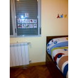
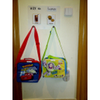
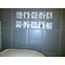

