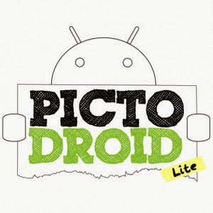
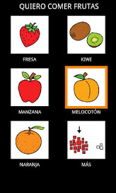

# Pictodroid Lite

## Para Saber Más

[PictoDroid](http://www.accegal.org/pictodroid/) es una aplicación para dispositivos Android que permite a los usuarios comunicarse a través del uso de pictogramas o pictos (signos que representan esquemáticamente un símbolo, objeto real o figura).

Laversión [Lite](http://www.accegal.org/pictodroid-lite/) únicamente permite expresar acciones muy concretas en modo puntual, realizando oraciones que empiezan por:

- vamos a...
- quiero jugar...
- quiero ir al baño
- quiero beber...
- quiero comer....
- estoy...

Al completar la selección de pictos el sistema procederá a la lectura de a frase formada.

En modo acumulativo, permite la creación de frases sencillas, mediante la selección de sujeto, verbo, predicado, adverbios y adjetivos. Una vez se completada la frase seleccionado pictos, el sistema lee la frase entera.

Todos los pictos pueden ser modificados o eliminados y es posible añadir tantos como sea necesario. El proceso se encuentra explicado en el [manual de la aplicación](http://www.accegal.org/wp-content/uploads/2011/11/manual-pictodroid-lite-castellano-v2.pdf).

Para conocer en profundidad el funcionamiento de PictoDroid Lite puede consultarse, además del [manual de la aplicación](http://www.accegal.org/wp-content/uploads/2011/11/manual-pictodroid-lite-castellano-v2.pdf), el vídeo adjuntado a continuación.

https//www.youtube.com/watch?v=7lm4hYdpnCA

Para acceder a la descarga de PictoDroid Lite y conocer otros desarrollos del Equipo Accegal se puede visitar su web: [http://www.accegal.org](http://www.accegal.org)

