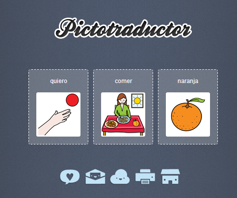
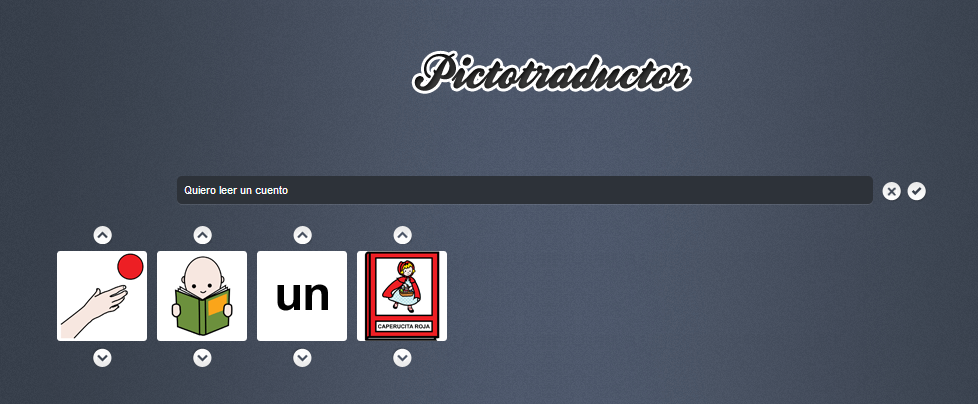
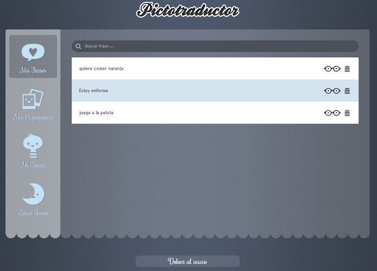

# Pictotraductor

## Para Saber Más

[Pictotraductor](http://www.pictotraductor.com/) es una aplicación web totalmente gratuita que nos permite **escribir con pictogramas**, es decir, escribir con texto, y que esta se traduzca en pictogramas. Incorpora funcionalidades interesantes como la posibilidad de hacer el negativo de cualquier pictograma utilizando sufijos delante de la palabra (-no) y la creación de pictogramas de textos para aquellas palabras que no dispongamos de pictogramas de la base de datos de ARASAAC o dentro de los pictogramas que hayamos subidos a nuestro espacio de trabajo personal.

Pictotraductor es un proyecto desarrollado para facilitar la comunicación con personas que tienen dificultades de expresión mediante el lenguaje oral y que se comunican más eficientemente mediante imágenes. Pensada como una herramienta útil para padres y profesionales, para poder comunicarse, en cualquier lugar fácilmente y sin perder grandes cantidades de tiempo en organizar lo que se quiere transmitir.

Como usuario registrado (el registro es gratuito) se pueden subir imágenes propias, guardar sus frases favoritas, imprimir, compartir en redes sociales...

