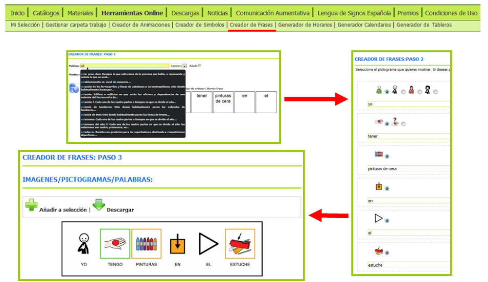
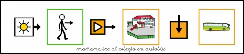
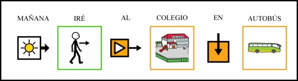
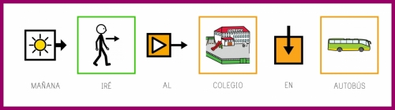
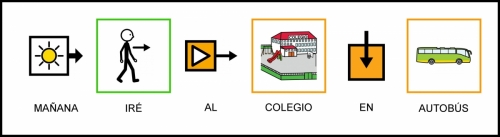
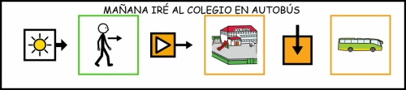

# U10. Creador de Frases

El **creador de frases** tiene como fin último transformar una frase escrita, en una imagen, de esa misma frase, compuesta por texto y pictogramas, facilitando, de esta forma, a los usuarios con dificultades en la comunicación la comprensión de contenidos y textos escritos habituales.

Frente a herramientas como **AraWord** o **Pictotraductor** (mirar el apartado Ampliación de Contenidos de este módulo), el creador de frases convierte toda la frase en una sola imagen con la resolución y formato que le definamos lo que la hace útil para diferentes propósitos como crear carteles, tarjetas, etc.

Esta herramienta se estructura en tres pasos:

1. En el **Paso 1** debemos seleccionar todas las palabras que van a componer nuestra frase y ponerlas en el orden deseado. Esta herramienta, a diferencia de las otras disponibles en ARASAAC sólo permite el uso de pictogramas de ARASAAC o componer pictogramas de texto (para aquellas palabras que no tienen pictograma o para aquellos casos en los que nos interese el texto en lugar del pictograma).
1. En el **Paso 2** tendremos la opción de seleccionar el pictograma que nos interese cuando haya más de uno disponible para cada una de las palabras seleccionadas.
1. Finalmente, en el **Paso 3** podremos configurar una serie de aspectos relativos a los pictogramas (tamaño, texto, color,...), el marco de la frase, el texto de la frase (posición, tipo de fuente, tamaño de fuente,....), formato final de archivo (PNG, JPG,...), dimensiones de la imagen generada, etc.

El resultado final, una vez combinadas diferentes variables del paso 3 pueden ser frases como:

## Importante

Para aprender el funcionamiento de esta herramienta se puede consultar el manual en:

[http://arasaac.org/zona_descargas/documentacion/manual_creador_frases_es.pdf](http://arasaac.org/zona_descargas/documentacion/manual_creador_frases_es.pdf)

