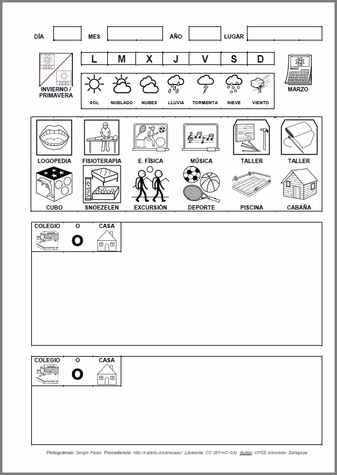

# U1. Importancia de la estructuración del espacio y del tiempo

El entorno en el que nos desenvolvemos se organiza de forma que constantementenos proporciona información. Esta información aprendemos a interpretarla de forma naturala lo largo de la vida. Pero no ocurre así con los niños con importantes alteraciones en eldesarrollo, como es el caso de los niños con autismo, por ejemplo.Esta incomprensión del entorno da lugar con frecuencia a problemas decomportamiento. Por lo que surge la necesidad de diseñar el entorno físico (aula, centroeducativo, casa) de forma estructurada, para facilitar al alumno autista, una organización delespacio y el tiempo que favorezca y fomente la comunicación, la anticipación y la predicciónde la actividad futura, así como el recuerdo de la actividad pasada y tomar conciencia de laactividad presente.

La presentación de la realidad mediante fotografías o pictogramas, resulta unametodología muy efectiva para trabajar con niños con TGD.

Esta estimulación la vamos a realizar a través de claves estimulares,preferentemente visuales, pero también auditivas, táctiles, etc, dirigidas a dos dimensionesfundamentales; ordenación del espacio y ordenación del tiempo.

**Ordenación del espacio**:

- Realizar **adaptaciones en el espacio del aula**, haciendo una distribución enzonas o espacios dedicados al trabajo de determinadas actividades, porejemplo; rincón de juegos, rincón de los cuentos, rincón de relajación etc.
- Utilizar **claves visuales**: ayuda a los niños con TGD a mejorar la comprensión social, para que puedan desenvolverse de forma autónoma. Sirven para señalar las actividades a realizar en un rincón, en una jornada concreta, permitiendo a todos los niños y niñas una participación activa, especialmente si se anticipan los cambios. Los sistemas de anticipación están íntimamente relacionados con el sentido de la acción, las personas con TGD, incluso las más capaces tienen dificultades para organizar las secuencias de acción siguiendo un plan concreto.
- **Disponer los materiales de forma clara y ordenada**, no sólo en el aula, sino en todo el centro.

Las ayudas o claves visuales para ordenar el espacio son:

- **Pictogramas**: y claves de señalización para diferentes espacios. (Aulas, comedor, talleres, psicomotricidad, logopedia, orientación etc.).
- Símbolos o **carteles para cada dependencia**, así como las fotos de las personas que están en cada una de ellas.
- **Líneas de colores** o cintas de belcro: para indicar recorridos, para acceder a ciertas dependencias, para marcar límites o delimitar espacios, ayudas que progresivamente iremos desvaneciendo, una vez las respeten y entiendan.

Ordenación del tiempo:

- **Agenda**: secuencia de las acciones principales de la jornada, a través de símbolos y claves visuales. Son como relojes adaptados que permiten conocer y predecir los acontecimientos que tendrán lugar durante la jornada escolar.
- **Agendas de aula**: Fotografías, fotografías y pictogramas, y pictogramas.
- **Agendas individuales**: adaptadas a las posibilidades de cada niño, desde niños muy afectados a niños de alto nivel o funcionamiento.

Fuente ([http://diversidad.murciaeduca.es/publicaciones/cee/doc/5_2.pdf](http://diversidad.murciaeduca.es/publicaciones/cee/doc/5_2.pdf))

**Experiencia práctica del trabajo de la orientación espacial y temporal en el aula**:
[http://ardilladigital.com/DOCUMENTOS/TECNOLOGIA%20EDUCATIVA/TEACCH/Estructuracion%20espacio-temporal%20en%20un%20aula%20de%20autismo%20-%20Velasco%20-%20art.pdf](http://ardilladigital.com/DOCUMENTOS/TECNOLOGIA%20EDUCATIVA/TEACCH/Estructuracion%20espacio-temporal%20en%20un%20aula%20de%20autismo%20-%20Velasco%20-%20art.pdf)

<iframe style="display: block; margin-left: auto; margin-right: auto;" src="//player.vimeo.com/video/63580513" frameborder="0" width="100%" height="334"></iframe>
[SÍ ESTOY AQUÍ](http://vimeo.com/63580513) from [lelesyesther](http://vimeo.com/user17210288) on [Vimeo](https://vimeo.com).