# U1. Importancia del juego adaptado

Vista la importancia del juego y del acceso al ocio en el desarrollo de todas las personas, deberemos adoptar una serie de decisiones fundamentales para lograr que las personas con dificultades en la comunicación puedan acceder a este tipo de situaciones con las adaptaciones adecuadas a sus características individuales y a sus capacidades.

A lo largo de esta unidad, nos centraremos, principalmente, en el tema de las adaptaciones referidas al juego.

## Ejemplos de adaptaciones básicas en el juego, referidas al área de comunicación.

En este caso, las **adaptaciones** afectarán, sobre todo, a la señalización del **entorno**,a la participación en **juegos** y a las **instrucciones y reglas básicas** sobre los mismos.

### Señalización del entorno.

En lo referente al **entorno**, será necesario **señalizar con fotografías o con pictogramas los distintos espacios y rincones**, donde se encuentran los juguetes y juegos, ya que una de las dificultades añadidas que nos vamos a encontrar en muchos casos, además de las problemas en la comunicación funcional, será la dificultad en la orientación espacial. A través de esta señalización, conseguiremos que la persona se desenvuelva en el contexto con mayor autonomía y reduciremos, por lo tanto, las situaciones de estrés y la dependencia de terceras personas para la realización de cualquier actividad.

A continuación, se pueden observar dos ejemplos de señalización de espacios y materiales.

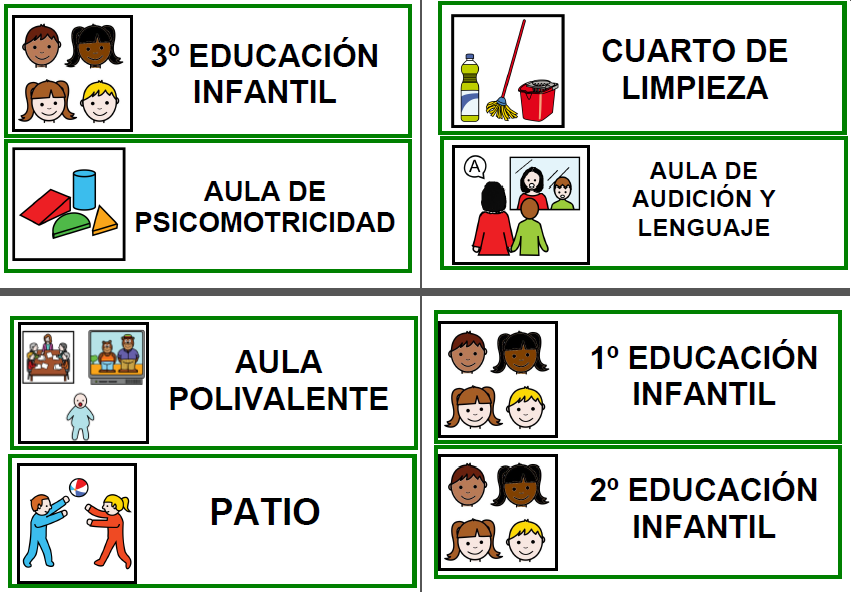

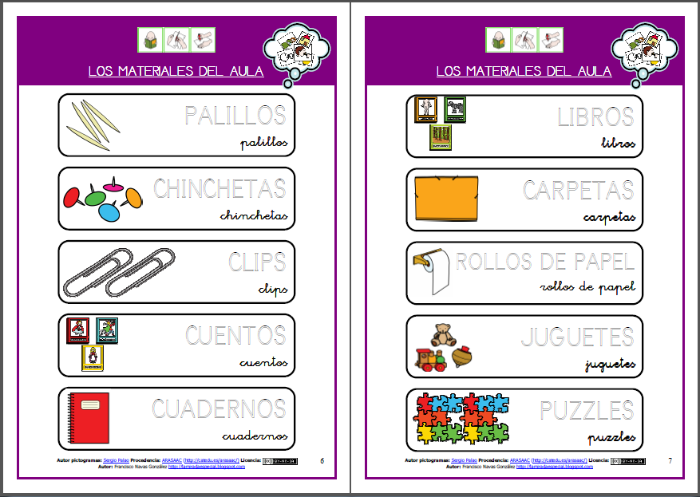

### Participación en el juego.

Nuestro objetivo principal debe ser que todas las personas participen en igualdad de condiciones en las actividades lúdicas que planteemos.

Para ello, podremos realizar adaptaciones básicas mediante la utilización de **tableros de comunicación** con imágenes o pictogramas, referidos a **juegos y juguetes**, que permitirán al usuario identificar, memorizar y evocar vocabulario sobre este tema, así como la posibilidad de seleccionar y elegir la actividad que quiere realizar.

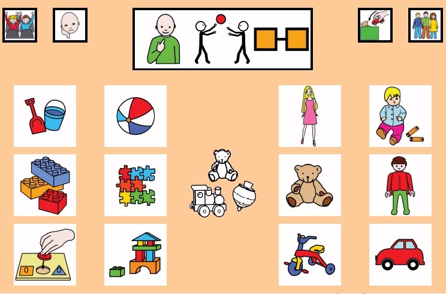

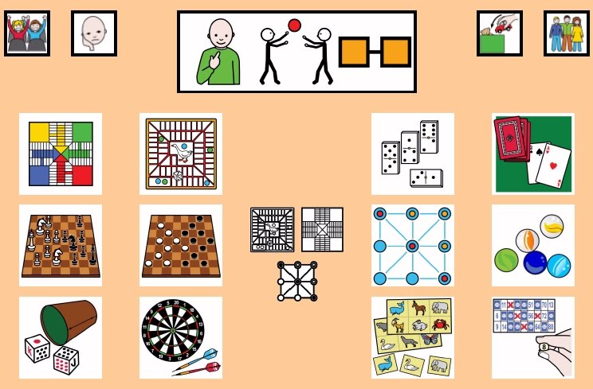

En una fase posterior, podemos elaborar tableros de comunicación en los que aparezca vocabulario referido, exclusivamente, a un juego o actividad concreta que resulte motivador para el usuario. El vocabulario puede ser variado y abarcar desde elementos y acciones básica, hasta emociones relacionadas con el mismo.

A continuación, podéis ver un ejemplos de este tipo de tablero para jugar a las muñecas.

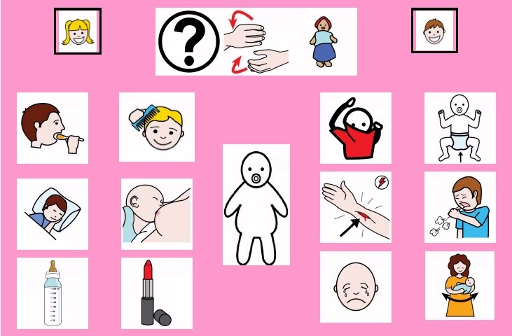

### Instrucciones básicas.

En caso del juego cooperativo, es muy importante que todos los participantes respeten las normas y las reglas básicas del mismo. Para ello, podemos elaborar **fichas adaptadas con** imágenes y pictogramas en las que se expliquen detalladamente las **instrucciones y el objetivo final** de la actividad.

Por ejemplo, si queremos jugar a"Piedra, papel o tijera", podemos utilizar la siguiente explicación:

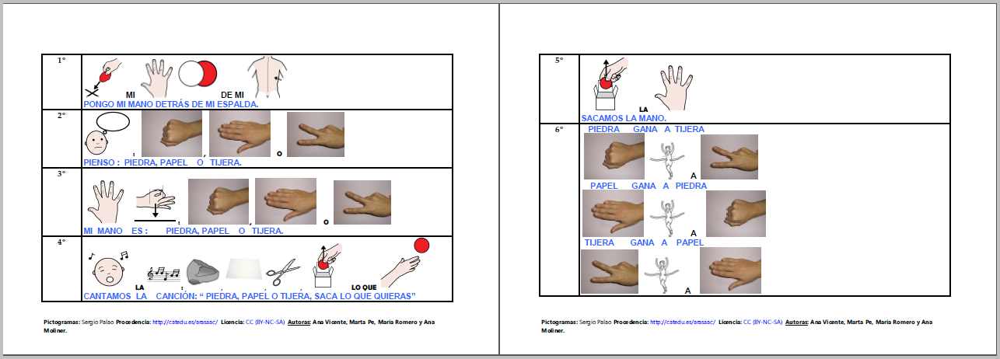

No debemos olvidarnos de la importancia de utilizar **guiones o historias sociales**, quenos ayudarán a trabajar **habilidades sociales y comportamientos apropiados** mediante la **anticipación detallada de los pasos** a seguir en el desarrollo de una actividad. A través de ellos, vamos a lograr quelas personas con diversidad funcional lleguen comprendan cómo se juega, cuáles son las normas básicas y cuál es la respuesta que se espera de ellos. De esta forma, reduciremos situaciones de estrés ante el planteamiento de una actividad desconocida y lograremos que se convierta en una actividad divertida, que es el objetivo principal de cualquier juego.

En la imagen inferior, se muestra un ejemplo en el que se explican los aspectos fundamentales para jugar a los bolos. Las explicaciones son complementadas con pictogramas, mediante la exposición de los materiales que se van a utilizar, las normas básicas y los aspectos fundamentales a destacar para el jugador.

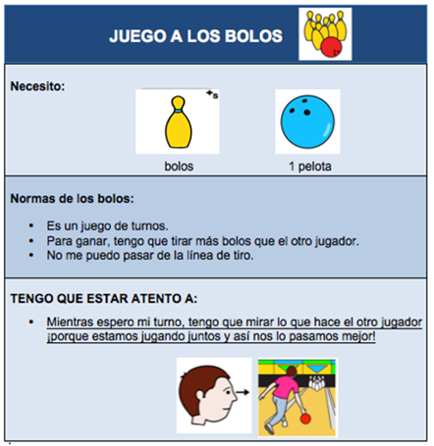

## Adaptación de juegos comerciales.

Un capítulo aparte merecen las adaptaciones que los profesionales y las familias realizan de juegos comerciales muy demandados y conocidos por los usuarios.

A continuación, os mostramos una pequeña relación de adaptaciones de este tipo.H

#### Juego de los Patitos

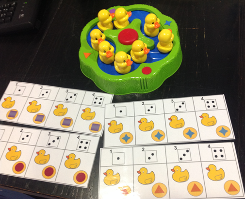

Juego de turnos en el que los jugadores tratan de juntar 4 patitos que tengan la misma forma geométrica (cuadrado lila, círculo rojo, triángulo naranja y estrella azul). Se ha realizado un tablero con pictogramas para ayudar a cada jugador a organizar sus patitos, además de ayudarle a conocer cuándo se ha acabo el juego. Han de colocar cada pato encima de su tablero.

#### Juego "¿Quién es quién?"

Juego en el que hay que adivinar el personaje que tiene escondido el contrincante en su carta secreta. Se han facilitado las posibles preguntas que se pueden realizar sobre el aspecto físico de esos personajes. Cuando se hace una pregunta, se retira o se marca con una cruz roja la opción de pregunta realizada. Además, se ha añadido un tablero para responder “sí” o “no”, para aquellos usuarios que fuera necesario.

#### Juego "Gira-Gallina"

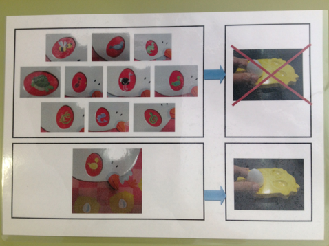

Se trata de un juego en el que hay que ganar cuatro huevos, llevando así el nido que va a tener cada jugador. Si sale el pollito, obtienes un huevo; si sale otro animal, no y pasa el turno. Se elabora un apoyo visual para indicar cuándo se obtiene huevo.

## Herramientas para el diseño y la creación de juegos adaptados.

Conscientes de la importancia de la adaptación de este tipo de actividades para conseguir la participación plena de todas las personas, desde ARASAAC, apostamos por el diseño y desarrollo de [**herramientas on line**](http://arasaac.org/herramientas.php), que aprovechan las posibilidades y recursos del portal y que nos permiten crear juegos adaptados con pictogramas o imágenes.

En estos momentos, contamos con varias herramientas on line que nos permiten generar distintos tipos de juego: **bingos, dominós y juegos de la oca**.

Este tipo de juegos, que podemos adaptar plenamente a las capacidades y características de los usuarios mediante la selección del vocabulario adecuado, nos van a resultar de mucha utilidad para nuestra labor diaria, porque nos van a permitir no sólo trabajar **la identificación, evocación y categorización de distintos repertorios de vocabulario**, sino también la **participación en actividades conjuntas** con sus compañeros, el **aprendizaje de normas básicas de comportamiento y el control de las emociones**.

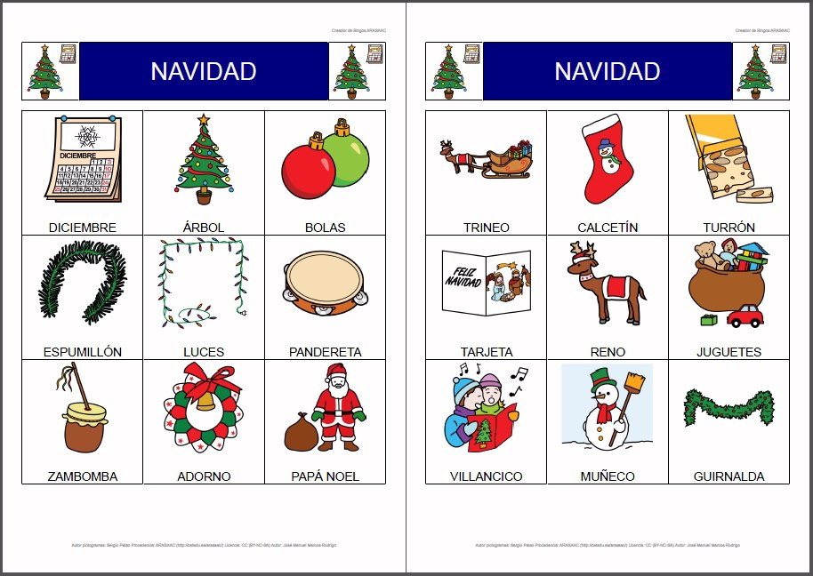

En los siguientes capítulos de esta unidad, podréis conocer el funcionamiento de estas herramientas y elaborar materiales de adaptados para vuestros usuarios.

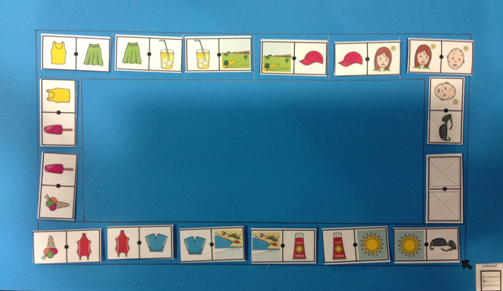

## REFERENCIAS

Barrios,S. (2013). Adaptando juegos de mesa para niños con autismo. Disponible en: [http://autismodiario.org/2013/08/09/adaptando-juegos-de-mesa-desde-la-terapia-ocupacional/](http://autismodiario.org/2013/08/09/adaptando-juegos-de-mesa-desde-la-terapia-ocupacional/)

## Para Saber Más

Puedes ver otros apoyos visuales para el juego de dados y de turnos en este material de Sabina Barrios:

[http://www.catedu.es/arasaac/materiales.php?id_material=734](http://www.catedu.es/arasaac/materiales.php?id_material=734)

