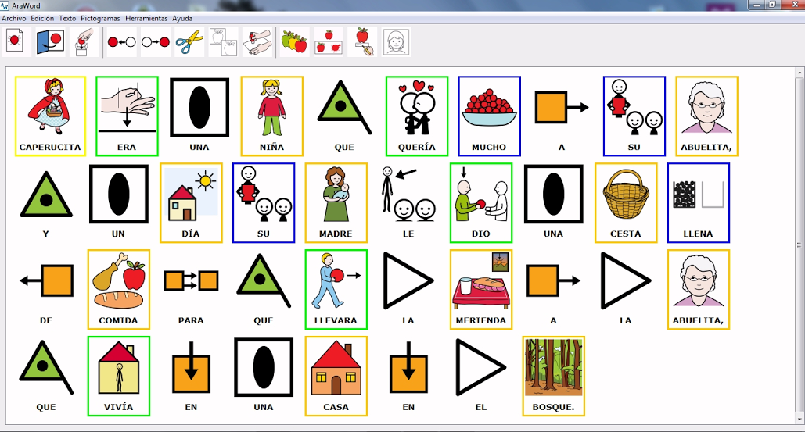

# U3. AraWord

**AraWord** es una aplicación informática de libre distribución, enmarcada dentro de la suite de herramientas para la comunicación aumentativa y alternativa AraSuite ([http://sourceforge.net/projects/arasuite/](http://sourceforge.net/projects/arasuite/)), que consiste en un procesador de textos que permite la escritura simultánea de texto y pictogramas, facilitando la elaboración de materiales y adaptación de textos para las personas que presentan dificultades en el ámbito de la comunicación funcional.

**AraWord** resulta también una herramienta muy útil para ser utilizada por usuarios que están adquiriendo el proceso de la lectura y de la escritura, ya que la aparición del pictograma, a la vez que se escribe, es un refuerzo muy positivo para reconocer y evaluar que la palabra o la frase escrita es correcta.

## Tarea

Para aprender el funcionamiento básico de **AraWord** leeremos el siguiente[MANUAL](http://arasaac.org/zona_descargas/software/2/Manual_AraWord.pdf)

[http://arasaac.org/zona_descargas/software/2/Manual_AraWord.pdf](http://arasaac.org/zona_descargas/software/2/Manual_AraWord.pdf)

**Enlace alternativo** (en caso de no funcionar el anterior)

[http://aularagon.catedu.es/materialesaularagon2013/arasaac/Docs/Manual_AraWord.pdf](http://aularagon.catedu.es/materialesaularagon2013/arasaac/Docs/Manual_AraWord.pdf)

