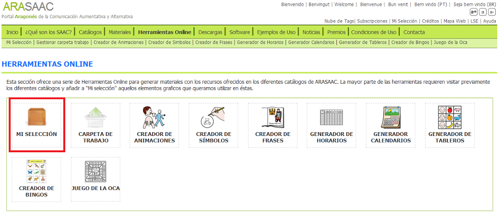
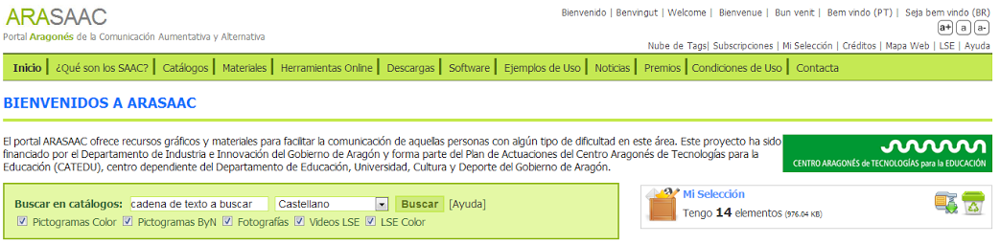
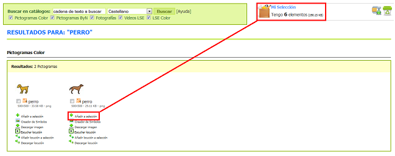
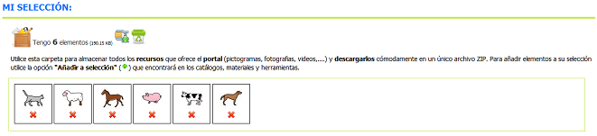
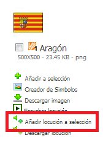
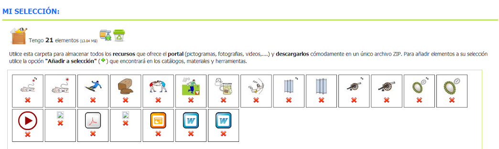

# U3. La carpeta “Mi selección”

## Importante

La carpeta ["Mi selección"](http://arasaac.org/cesta.php) nos permite, al igual que se haría en un supermercado, llenar el carro con todos aquellos recursos que nos interesen bien sea para descargar posteriormente en un único archivo ZIP o para utilizar en las diferentes herramientas online del portal (menos en el creador de frases).

Conforme vayamos navegando por el portal podemos ir a añadiendo elementos a la carpeta"Mi Selección" la cual pervivirá mientras naveguemos por el portal. En el momento que cerremos el navegador el contenido de la carpeta es eliminado. Se trata, por tanto, de una carpeta temporal.

Los elementos que podemos añadir a nuestra carpeta temporal son: cualquiera de los recursos ofrecidos en los diferentes catálogos (pcitogramas, imágenes, videos y fotografías en LSE), locuciones, materiales y algunos de los materiales generados con las algunas de las herramientas online (símbolos, animaciones o frases).

### MANEJANDO LA CARPETA"MI SELECCIÓN"

Cuando realizamos la búsqueda de cualquier recurso del portal (pictograma, fotografía, video, locución, etc.) para nuestro trabajo posterior, podemos realizar dos acciones: descargar directamente el recurso a nuestro ordenador o añadir el recurso a "**Mi selección**", utilizando el menú contextual **Añadir a selección**, que aparece en el recurso.

En el ejemplo inferior, se han seleccionando pictogramas sobre "animales domésticos" (utilizando el buscador tal y como se explicaba en la anterior unidad) y añadiéndolos a la selección para descargarlos todos juntos en un paquete. En estos momentos, el cajón señala que tiene 6 elementos.

Si pulsamos sobre 6 elementos, se abrirá la carpeta Mi selección y nos mostrará los pictogramas que hemos incluido en el cajón hasta ahora.

Una vez dentro de la carpeta Mi selección, podemos realizar las siguientes acciones:

Al igual que se han añadido pictogramas a la selección podemos añadir otros recursos como locuciones, fotografías y vídeos en LSE, materiales, etc.

Al añadir a mi selección elementos diferentes vemos que la vista previa cambia y que en ella podemos escuchar las locuciones, ver los vídeos en LSE, saber qué tipo de documentos hemos añadido (PDF, Word, PPT, etc),...

