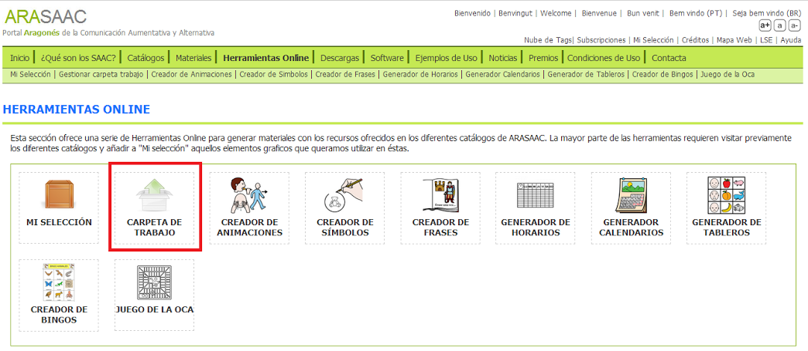
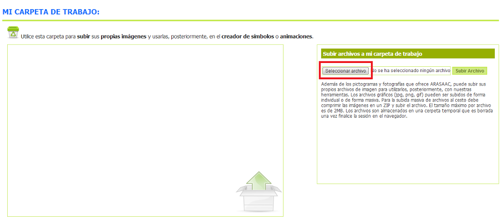
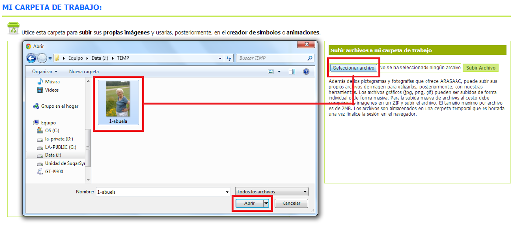
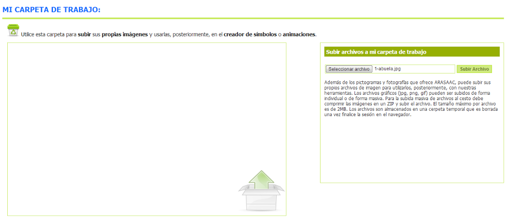
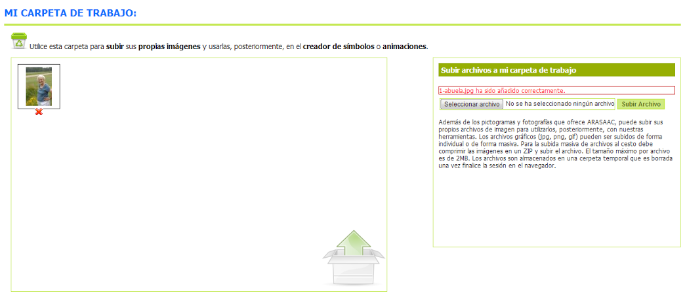
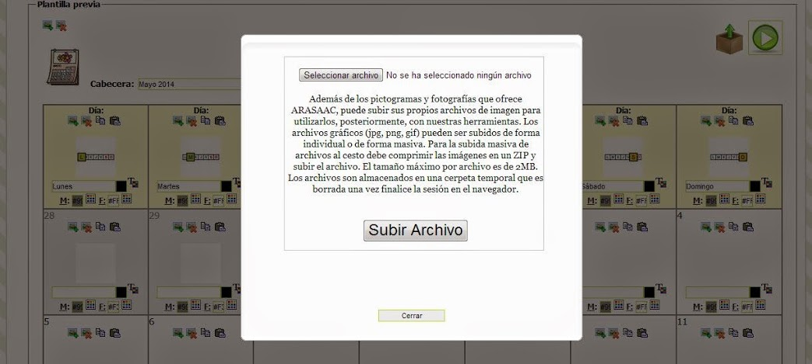
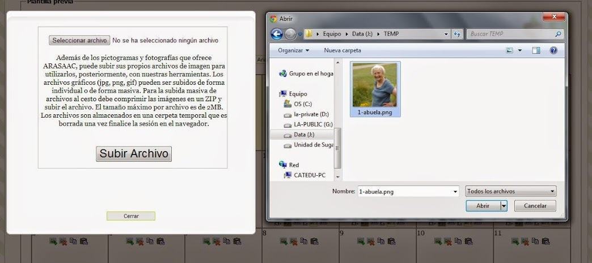
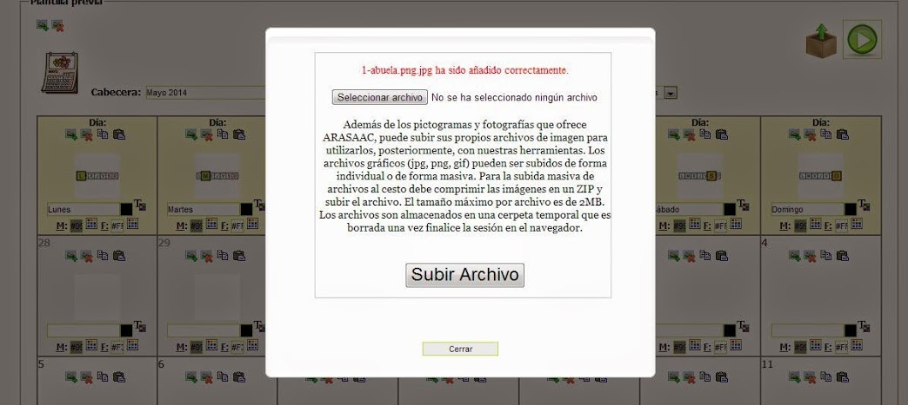

# U4. “Carpeta de trabajo”

Si además de los pictogramas e imágenes de ARASAAC queremos utilizar nuestras propias imágenesen las diferentes herramientas online del portal (menos en el Creador de Frases) deberemos recurrir a la "**Carpeta de trabajo**" o al botón "**Subir archivos a mi carpeta de trabajo**" disponible en las diferentes herramientas.

Podemos desglosar el funcionamiento de la herramienta en diferentes pasos dependiendo de si accedemos desde la página"[**Herramientas online**](http://arasaac.org/herramientas.php)" o desde cada una de las herramientas.

### ACCESO DESDE HERRAMIENTAS ONLINE

**PASO 1**: Desde la página"[Herramientas online](http://arasaac.org/herramientas.php)" del portal pulsamos sobre la opción ["Carpeta de trabajo"](http://arasaac.org/carpeta_trabajo.php).

**PASO 2**: Una vez dentro, pulsamos en "Seleccionar archivo".

**PASO 3**: En la venta emergente que se abre seleccionamos de nuestro disco duro la imagen a importar y pulsamos en Abrir.

**PASO 4**: De regreso a la pantalla inicial pulsamos en"Subir archivo".

**PASO 5**: Finalmente nuestra imagen ya está importada y lista para ser utilizada en cualquiera de las herramientas online de ARASAAC (salvo el creador de Frases).

### ACCESO DESDE CADA UNA DE LAS HERRAMIENTAS

Desde cada una de las herramientas online podemos subir nuestras propias imágenes utilizando la opción de "Subir archivos a mi carpeta de trabajo" identificado por el icono adjuntado a la izquierda.

Una vez hayamos pulsado nos aparecerá una nueva ventana en la que deberemos seleccionar el archivo de imagen a subir.

Es importante leer las indicaciones que se nos da:

*"Además de los pictogramas y fotografías que ofrece ARASAAC, puede subir sus propios archivos de imagen para utilizarlos, posteriormente, con nuestras herramientas. Los archivos gráficos (jpg, png, gif) pueden ser subidos de forma individual o de forma masiva. Para la subida masiva de archivos al cesto debe comprimir las imágenes en un ZIP y subir el archivo. El tamaño máximo por archivo es de 2MB. Los archivos son almacenados en una carpeta temporal que es borrada una vez finalice la sesión en el navegador."*

Una vez leídas, pulsamos en "**Seleccionar archivo**".

Una vez escogida la imagen del disco duro se pulsa en "**Abrir**". Una vez de regreso en la ventana anterior, hacemos clic en "**Subir archivo**".Una vez subido el archivo recibiremos un mensaje de información diciendo si el proceso ha sido correcto o ha surgido algún problema.

Completada la importación la imagen ésta pasa a estar disponible para su uso en la herramienta que se esté utilizando.

## Importante

Con el fin de poder utilizar imágenes de alumnos, los archivos subidos a la carpeta de trabajo de ARASAAC son borrados una vez la sesión finaliza no quedando, por tanto, rastro alguno de los mismos.

