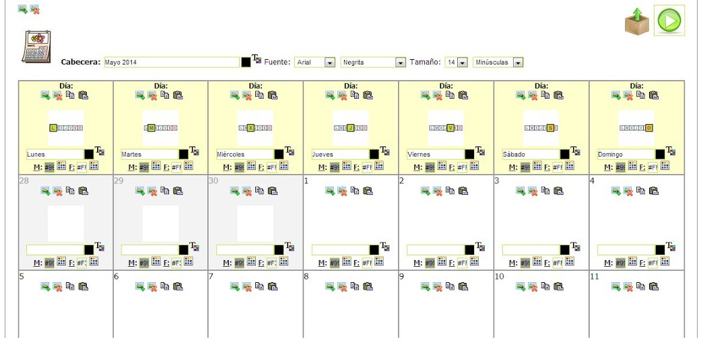
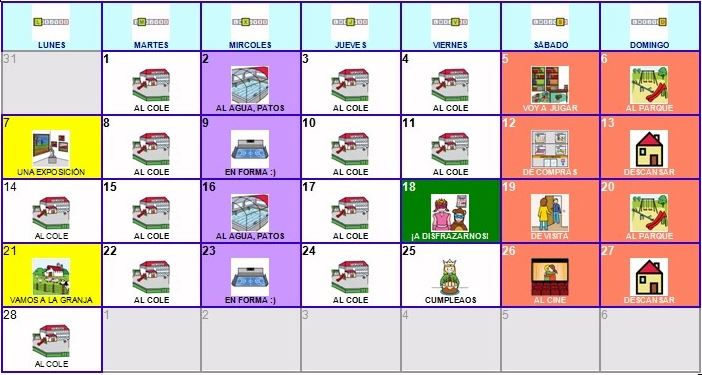

# U4. Creador de Calendarios

El creador de calendariosfacilita a todos los usuarios del portal el diseño y la creación de calendarios personalizados que complementa el Generador de Horarios explicado anteriormente en tanto ayuda a nuestros alumnos a situarse temporalmente a lo largo de un mes concreto, pudiendo establecer las actividades, acontecimientos o rutinas adecuadas para cada uno de los días de dicho mes.

El funcionamiento de esta herramienta es muy similar al explicado anteriormente para el Generador de Horarios.Primero, seleccionamos elMesy elAñoque vamos a utilizar en nuestro calendario. También podemos seleccionar que aparezcaEncabezadopara que aparezca automáticamente el pictograma correspondiente al mes y el texto que le acompaña (ambos son modificables).

4.15 Plantilla del Calendario seleccionado

También tenemos la opción de mostrar una fila con losdías de la semana (con texto en cualquiera de los idiomas de los que se dispone de traducción)y distintas posibilidades para configurar la posición en la celda del número correspondiente a los días del mes, así como el formato del mismo.

4.16 Calendario final generado

Al igual que en las otras herramientas online se recomienda hacer distintas pruebas y pulsar en"Generar Plantilla Previa en RTF"para ver el resultado. Como ya comentábamos en otras herramientas, el archivo generado eseditable en Microsoft Word u Open Office Writer pudiéndose así dar los últimos retoques y ajustes al calendario.

## Importante

Para aprender el funcionamiento de esta herramienta se puede consultar el manual en:

[http://arasaac.org/zona_descargas/documentacion/manual_generador_calendarios_es.pdf](http://arasaac.org/zona_descargas/documentacion/manual_generador_calendarios_es.pdf)

