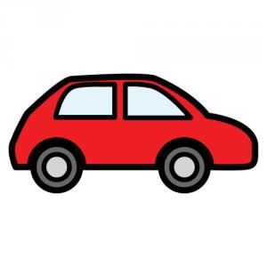
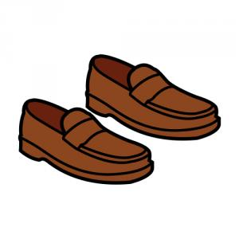
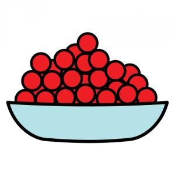
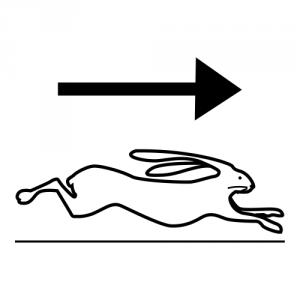
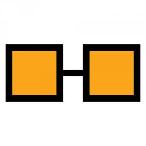
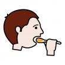
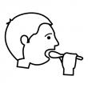
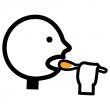

# U4. Los pictogramas como SAAC

Los pictogramas son representaciones gráficas con las que convivimos a diario, casi sin darnos cuenta, en diferentes espacios. Durante varias décadas han demostrado su valía a la hora de presentar una información complementaria al usuario que le ayude a orientarse en el espacio y en el tiempo. Por eso, dentro de los SAAC, uno de los sistemas más utilizados es el de la comunicación mediante **pictogramas**.

Un pictograma es un dibujo que puede representar una realidad concreta (p.e. un objeto, animal, persona, etc.), una realidad abstracta (p.e. un sentimiento), una acción, (p.e. leer), e incluso un elemento gramatical (p.e. adjetivos, conjunciones, artículos, preposiciones, etc.).

El uso de un pictograma para comunicar es para la persona unaforma de transformar su realidad en imágenes que representan "conceptos", "ideas", "acciones", "elementos que forman parte de suvida cotidiana", y así, a través de esas imágenes, poder expresarse.

Por otro lado, el pictograma refiere a todo el conjunto de personas, objetos o acciones que pudieran representarse con esa imagen (e incluso ideas asociadas). Es decir, al "concepto".

Por ejemplo, en la siguiente imagen aparece un coche rojo. El pictograma representa no sólo a todos los coches rojos, sino a:
* Coches de diferentes colores
* Coches de diferentes marcas
* Coches de diferente número de plazas
* Coches con diferentes funciones: familiar, policía,
* Coches con connotaciones personales: p.e el coche de mis padres

En otras ocasiones, la imagen del pictograma va más allá de cómo ésta aparece, puesto que el "concepto" o "elemento" al que se refiere no está directamente representado con el dibujo, sino que es arbitrario y aceptado por convención.

Además, existen varios tipos de pictogramas:

De color, como los anteriormente mostrados

Sin color o transparentes, en los que solo aparece la silueta del pictograma

Esquemáticos, representan generalmente acciones y cuyo diseño está basado en siluetas

Contraste blanco sobre negro. Con imágenes lineales y dirigido a personas con baja visión 

(Fuente del texto: ["Mi comunicador de Pictogramas"](http://www.ceapat.es/ceapat_01/centro_documental/tecnologiasinformacion/sistemas_comunicacion_aumentativa/IM_055625), Clara Delgado Santos, CEAPAT)

