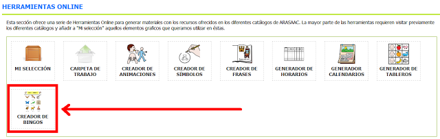
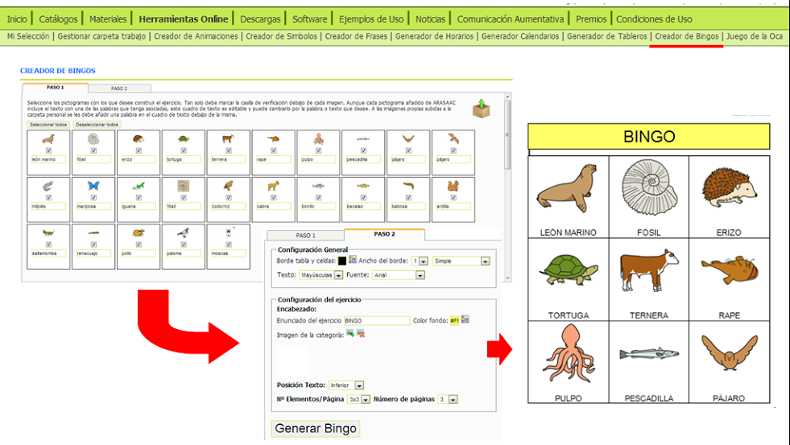
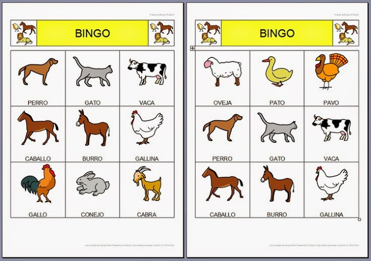

# U5. Creador de Bingos

El [creador de Bingos](http://arasaac.org/herramientas.php) permite generar e imprimir **cartones** de bingo a partir de los pictogramas, el número de páginas y elementos por página que se hayan seleccionando.

El **Bingo**, en **educación**, es unjuego consistente en repartir una serie de **cartones**, generalmente asociados a una **categoría**, entre los distintos jugadores. De una caja o bolsa, se van sacando pictogramas o imágenes, iguales a los que existen en los tableros y los jugadores deberán ir tachando o colocando encima el pictograma o imagen correspondiente. El ganador es el jugador que complete primero su cartón.

Este tipo de actividad resulta de gran utilidad para trabajar aspectos relacionados con la **atención**, la **concentración**, la **discriminación visual**, la **categorización de palabras** y el **lenguaje oral**.

 

Al igual que el resto de Herramientas Online de ARASAAC se encuentra en:[http://arasaac.org/herramientas.php](http://arasaac.org/herramientas.php)

## Importante

Para aprender el funcionamiento de esta herramienta se puede consultar el manual en:

[http://arasaac.org/zona_descargas/documentacion/manual_creador_bingos_es.pdf](http://arasaac.org/zona_descargas/documentacion/manual_creador_bingos_es.pdf)

