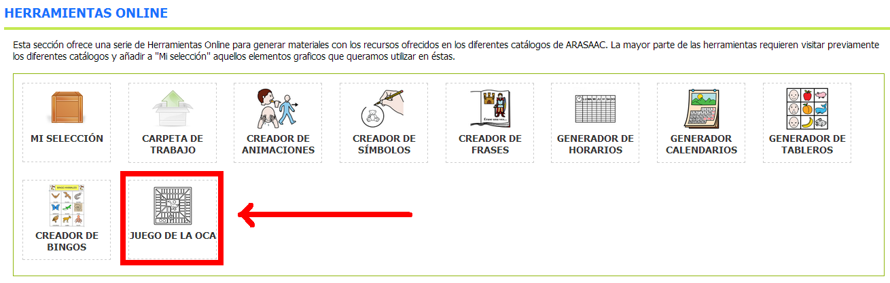
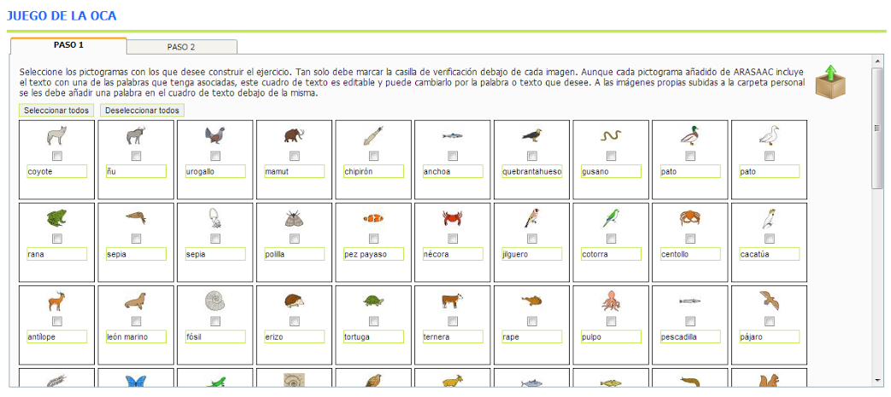
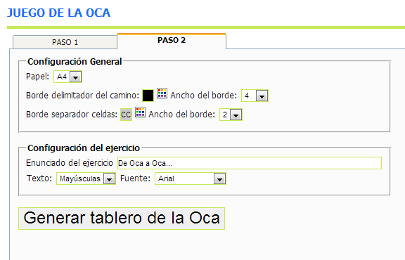
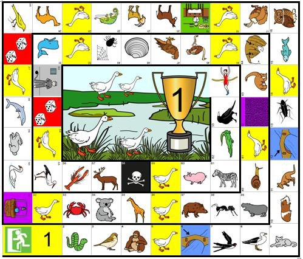

# U6. Generador del Juego de la Oca

Esta [herramienta online](http://arasaac.org/herramientas.php), al igual que el generador de bingos, permite, fácilmente, crear un **tablero de la Oca**, con los pictogramas que hayamos seleccionado, que podremos imprimir y utilizar con nuestros alumnos.

De un modo lúdico, se puede trabajar aspectos relacionados con campos semánticos, matemáticas (números, contar casillas,...), atención, concentración,....

El manejo de esta herramienta es muy similar al explicado anteriormente para el Creador de Bingos.

En el **Paso 1** deberemos buscar los pictogramas que vamos a incluir en nuestro Juego de la oca y añadirlos a nuestra selección. Necesitaremos **41 pictogramas distintos**, si queremos que no se repitan. El resto de las casillas están configuradas por defecto para todos los juegos que hagamos. No hace falta introducir ni los puentes, ni las ocas, ni la cárcel,...

Una vez seleccionados los pictogramas que vamos a utilizar en el **Paso 1**, le damos a la pestaña **Paso 2** y nos aparece la siguiente ventana:

En este segundo paso se puede configurar el **Tamaño del Papel**, el **enunciado** de nuestro tablero y **algunos aspectos** visuales relacionados con los bordes.  Pulsando el botón **Generar tablero** de la Oca se generará un **documento RTF** que se puede abrir y modificar con **Microsoft Word** u **Open Office** antes de imprimirlo.

