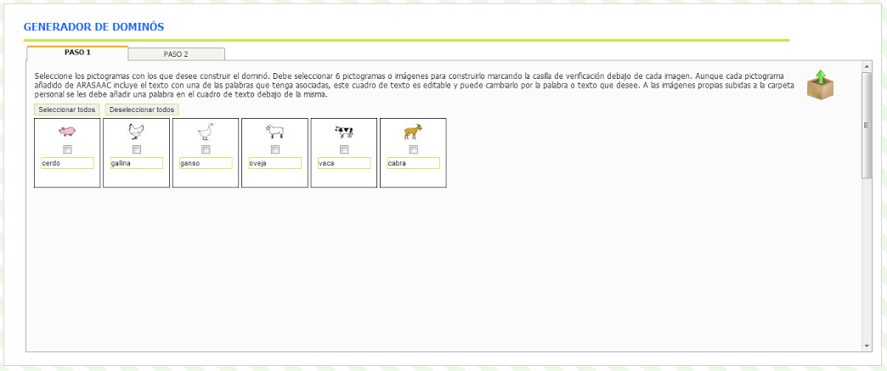
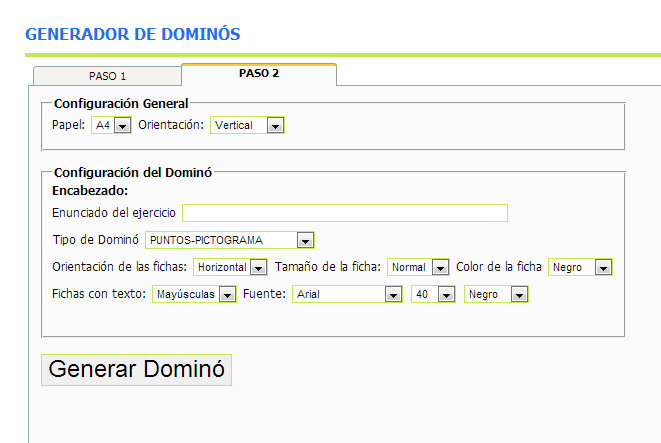
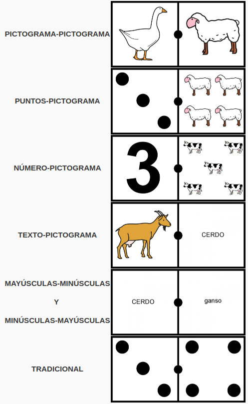

# U7. Generador de Dominós

Esta [herramienta online](http://arasaac.org/herramientas.php), al igual que el generador de bingos y el de ocas permite, fácilmente, crear un **juego de dominó**,con los pictogramas que hayamos seleccionado (ver la unidad 3 "La carpeta Mi Selección" y la unidad 4 "Carpeta de trabajo"), que podremos imprimir, recortar y utilizar con nuestros alumnos.

De un modo lúdico, se puede trabajar aspectos relacionados con campos semánticos, lectura, matemáticas (números, contar,...), atención, concentración,....

El manejo de esta herramienta es muy similar al explicado anteriormente para el Creador de Bingos y el Generador de Juegos de la Oca.

En el **Paso 1** deberemos buscar los pictogramas que vamos a incluir en nuestro Juego de la oca y añadirlos a nuestra selección.Necesitaremos 6 pictogramas o imágenes que hayamos subido a la carpeta de trabajo. Si no seleccionamos 6 pictogramas el sistema nos devolverá un mensaje de error y no nos construirá el dominó.

Una vez seleccionados los pictogramas que vamos a utilizar en el **Paso 1**, le damos a la pestaña **Paso 2** y nos aparece la siguiente ventana:

En este segundo paso se puede configurar variables generales como el **Tamaño del Papel** y su **orientación**.

Dentro de la configuración del dominó podemos escribir unenunciadoque se imprimirá en la parte superior del mismo y definir el tipo de dominó que queremos crear. Las opciones que disponemos son:

Además del tipo de dominó se pueden configurar diferentes aspectos relacionados con las fichas como su **orientación** (horizontal o vertical), el **tamaño** (Normal o Grande) o el color(de los bordes).

Finalmente, para los dominó que llevan **texto** podemos configurar la **fuente**, el **tamaño** y el **color**.

Pulsando el botón **Generar Dominó** se generará un **documento RTF** que se puede abrir y modificar con **Microsoft Word** u **Open Office** antes de imprimirlo.

