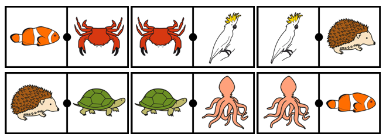
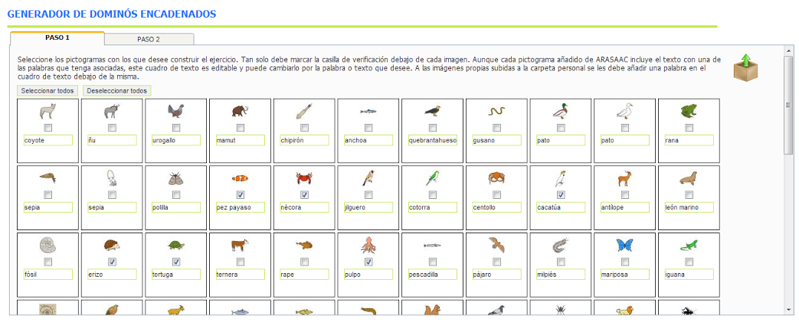
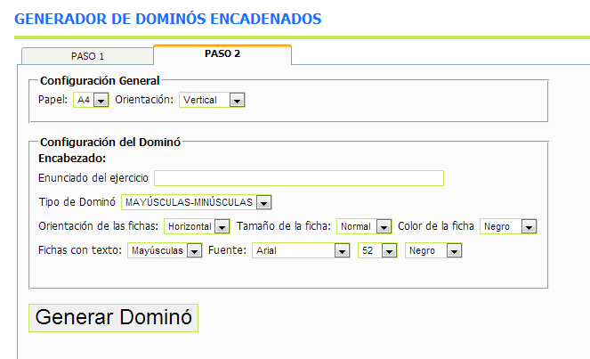
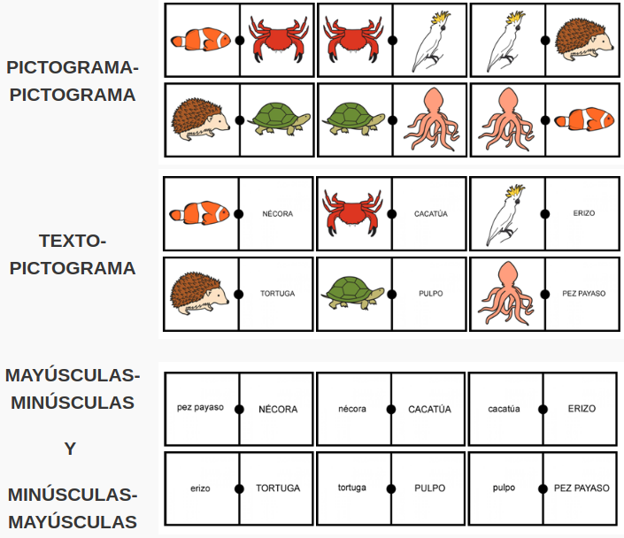

# U8. Generador de Dominós Encadenados

Esta [herramienta online](http://arasaac.org/herramientas.php), es una evolución del tradicional juego del dominó y nos permite generar **juego de dominó encadenado**,con los pictogramas que hayamos seleccionado (ver la unidad 3 "La carpeta Mi Selección" y la unidad 4 "Carpeta de trabajo"), que podremos imprimir, recortar y utilizar con nuestros alumnos.

El dominó encadenado se caracteriza porque el segundo elemento de cada ficha enlaza con el primero de otra ficha y el segundo elemento de la última ficha enlaza con el primero de la primera ficha.

De un modo lúdico, se puede trabajar aspectos relacionados con campos semánticos, lectura, atención, concentración,....

El manejo de esta herramienta es muy similar al explicado anteriormente para el generador de dominós.

En el **Paso 1** deberemos buscar los pictogramas que vamos a incluir en nuestro Juego de la oca y añadirlos a nuestra selección. Necesitaremos un mínimo de 2 pictogramas o imágenes que hayamos subido a la carpeta de trabajo o a mi selección para hacer un bingo encadenado.

Una vez seleccionados los pictogramas que vamos a utilizar en el **Paso 1**, le damos a la pestaña **Paso 2** y nos aparece la siguiente ventana:

En este segundo paso se puede configurar variables generales como el **Tamaño del Papel** y su **orientación**.

Dentro de la configuración del dominó podemos escribir unenunciadoque se imprimirá en la parte superior del mismo y definir el tipo de dominó que queremos crear. Las opciones que disponemos son:

Además del tipo de dominó se pueden configurar diferentes aspectos relacionados con las fichas como su **orientación** (horizontal o vertical), el **tamaño** (Normal o Grande) o el **color** (de los bordes).

Finalmente, para los dominó que llevan **texto** podemos configurar la **fuente**, el **tamaño** y el **color**.

Pulsando el botón **Generar Dominó** se generará un **documento RTF** que se puede abrir y modificar con **Microsoft Word** u **Open Office** antes de imprimirlo.

