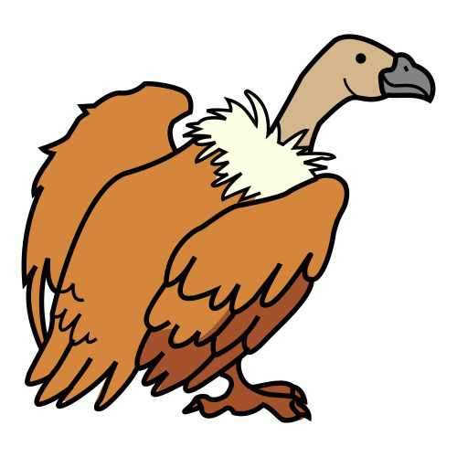
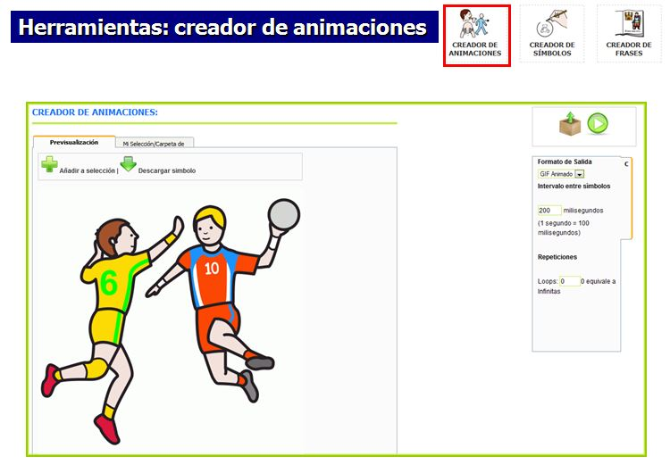

# U9. Creador de Animaciones

El **creador de animaciones** tiene como finalidad crear una secuencia animada y sucesiva de pictogramas, fotografías o imágenes en formato GIF o SWF.

Este tipo de animaciones se utilizan para secuenciar rutinas, para estructurar el tiempo, para trabajar campos semánticos o para contar cuentos.

Los GIF animados resultantes, para ser reproducidos, pueden ser insertados en una presentación PowerPoint, blogs o páginas web.

Al igual que el resto de Herramientas Online de ARASAAC se encuentra en:[http://arasaac.org/herramientas.php](http://arasaac.org/herramientas.php)

## Importante

Para aprender el funcionamiento de esta herramienta se puede consultar el manual en:

[http://arasaac.org/zona_descargas/documentacion/manual_creador_animaciones_es.pdf](http://arasaac.org/zona_descargas/documentacion/manual_creador_animaciones_es.pdf)

